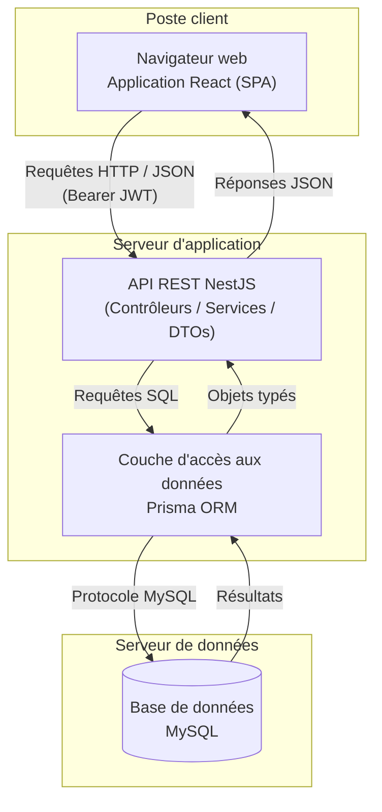
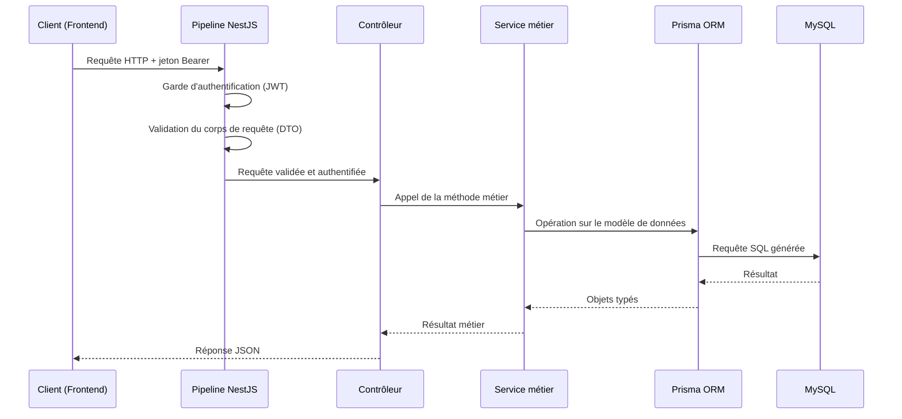
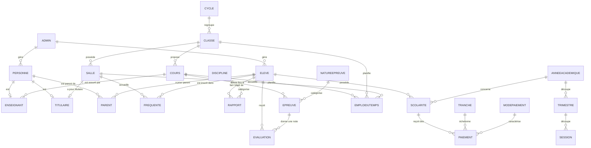
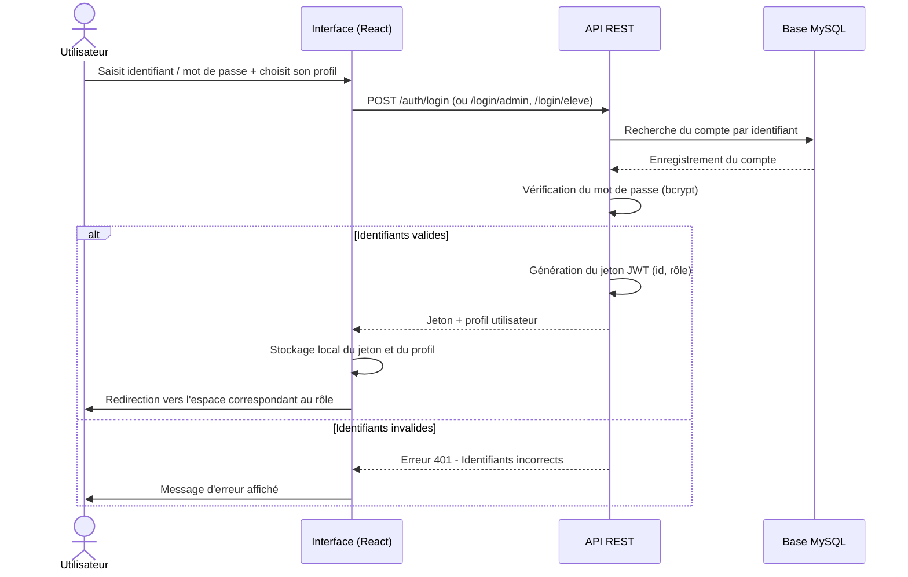
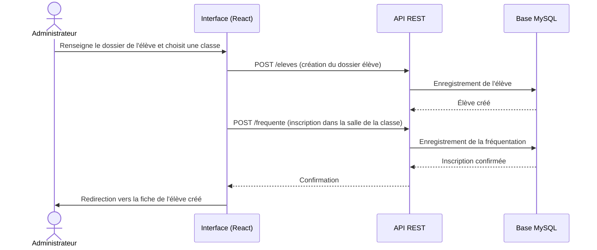
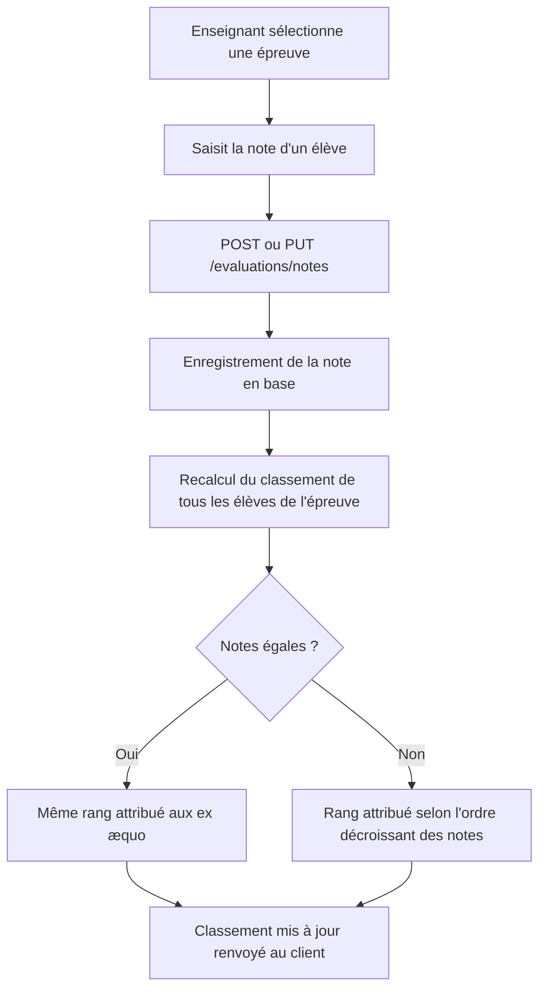
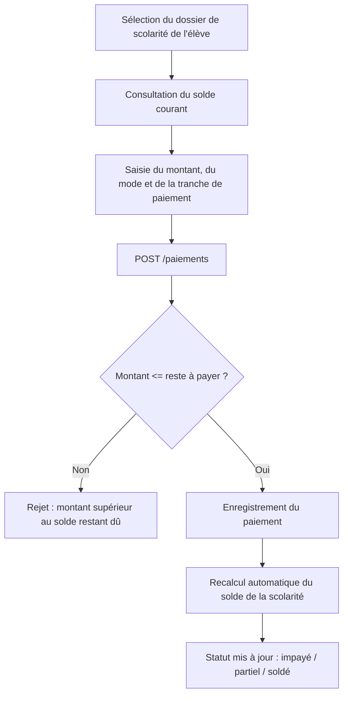

# Rapport technique

## Scholarly — Plateforme de gestion scolaire pour les établissements primaires

**Sous-titre commercial de l'application : BrightPath Academy**

---

**Auteur :** _[À compléter par l'étudiant]_
**Établissement :** _[À compléter]_
**Filière / Niveau :** _[À compléter]_
**Encadrant :** _[À compléter]_
**Année académique :** _[À compléter]_

---

## Table des matières

1. [Présentation du projet](#1-présentation-du-projet)
2. [Contexte](#2-contexte)
3. [Problématique](#3-problématique)
4. [Objectifs](#4-objectifs)
5. [Cahier des charges](#5-cahier-des-charges)
6. [Besoins fonctionnels](#6-besoins-fonctionnels)
7. [Besoins non fonctionnels](#7-besoins-non-fonctionnels)
8. [Technologies utilisées](#8-technologies-utilisées)
9. [Architecture générale](#9-architecture-générale)
10. [Architecture frontend](#10-architecture-frontend)
11. [Architecture backend](#11-architecture-backend)
12. [Base de données MySQL](#12-base-de-données-mysql)
13. [Schéma Prisma](#13-schéma-prisma)
14. [Organisation du projet](#14-organisation-du-projet)
15. [Description détaillée des modules](#15-description-détaillée-des-modules)
    - 15.1 [Authentification](#151-authentification)
    - 15.2 [Gestion des utilisateurs](#152-gestion-des-utilisateurs)
    - 15.3 [Gestion des rôles](#153-gestion-des-rôles)
    - 15.4 [Gestion des élèves](#154-gestion-des-élèves)
    - 15.5 [Gestion des enseignants](#155-gestion-des-enseignants)
    - 15.6 [Gestion des administrateurs](#156-gestion-des-administrateurs)
    - 15.7 [Gestion des classes](#157-gestion-des-classes)
    - 15.8 [Gestion des cours](#158-gestion-des-cours)
    - 15.9 [Gestion des évaluations](#159-gestion-des-évaluations)
    - 15.10 [Gestion des emplois du temps](#1510-gestion-des-emplois-du-temps)
    - 15.11 [Gestion de la discipline](#1511-gestion-de-la-discipline)
    - 15.12 [Gestion des paiements](#1512-gestion-des-paiements)
16. [API REST](#16-api-rest)
17. [Sécurité](#17-sécurité)
18. [Flux de fonctionnement](#18-flux-de-fonctionnement)
19. [Déploiement](#19-déploiement)
20. [Installation](#20-installation)
21. [Maintenance](#21-maintenance)
22. [Évolutions possibles](#22-évolutions-possibles)
23. [Conclusion](#23-conclusion)

---

## 1. Présentation du projet

**Scholarly** est une application web de gestion scolaire conçue pour répondre aux besoins administratifs et pédagogiques des écoles primaires. Elle centralise, au sein d'une plateforme unique accessible depuis un navigateur, l'ensemble des opérations courantes d'un établissement : inscription et suivi des élèves, gestion du personnel enseignant, organisation des classes et des cours, saisie et consultation des notes, suivi disciplinaire, gestion financière de la scolarité, et planification des emplois du temps.

L'application repose sur une architecture web moderne en trois couches : une interface utilisateur monopage (Single Page Application) développée en React, une couche de services exposée sous forme d'API REST développée avec le framework NestJS, et une base de données relationnelle MySQL assurant la persistance des données. Elle propose trois espaces de travail distincts — administration, enseignant, élève — chacun offrant des fonctionnalités adaptées au rôle de l'utilisateur connecté.

Le nom commercial affiché aux utilisateurs dans l'interface est **BrightPath Academy**, tandis que **Scholarly** désigne le projet logiciel dans son ensemble.

---

## 2. Contexte

La gestion administrative et pédagogique des écoles primaires repose encore, dans de nombreux établissements, sur des supports manuels ou des outils bureautiques génériques (tableurs, documents isolés) pour suivre les inscriptions, les notes, la discipline et les paiements de scolarité. Cette approche présente des limites bien connues : absence de centralisation des informations, risque d'erreurs de saisie, difficulté à croiser les données (par exemple relier une note à un élève, une classe, un enseignant et une période scolaire), et absence de vision consolidée pour la direction de l'établissement.

Le projet Scholarly a été conçu pour répondre à ce besoin de numérisation en proposant un outil unique, accessible en ligne, structurant l'ensemble du cycle de vie scolaire d'un élève : de son inscription jusqu'au suivi de ses résultats, de sa discipline et de sa scolarité financière, en passant par son emploi du temps hebdomadaire.

L'application est pensée pour un établissement scolaire unique (mono-établissement), avec une hiérarchie simple à trois niveaux d'utilisateurs : l'administration (qui supervise l'ensemble du système), le corps enseignant (qui intervient sur ses cours et ses classes), et les élèves (qui consultent leurs propres informations).

---

## 3. Problématique

La problématique centrale à laquelle répond Scholarly peut être formulée ainsi :

> Comment offrir à un établissement scolaire primaire un système d'information unique, sécurisé et accessible à distance, qui centralise la gestion administrative (élèves, enseignants, classes), pédagogique (cours, évaluations, emplois du temps), disciplinaire et financière (paiements de scolarité), tout en garantissant à chaque catégorie d'utilisateur — administration, enseignant, élève — un accès adapté à son rôle ?

Cette problématique se décline en plusieurs sous-questions techniques traitées par l'application :

- Comment authentifier de manière sécurisée trois catégories d'utilisateurs aux mécanismes de connexion distincts (administrateurs, personnel de l'établissement, élèves) ?
- Comment modéliser les relations complexes entre élèves, classes, salles, cours et enseignants dans un schéma de données cohérent ?
- Comment automatiser les calculs pédagogiques (moyennes pondérées, classements) et financiers (soldes de scolarité) de façon fiable ?
- Comment détecter et empêcher les conflits d'organisation (chevauchement d'un même créneau horaire pour une classe ou une salle) ?
- Comment structurer une base de code backend et frontend modulaire, maintenable et extensible à de nouveaux besoins ?

---

## 4. Objectifs

Les objectifs poursuivis par le développement de Scholarly sont les suivants :

1. **Centraliser** l'ensemble des données administratives et pédagogiques d'un établissement scolaire dans une base de données relationnelle unique.
2. **Sécuriser** l'accès à l'application au moyen d'une authentification par jeton (JWT) et d'un hachage robuste des mots de passe.
3. **Différencier les espaces de travail** selon le rôle de l'utilisateur (administration, enseignant, élève), chacun avec une interface et des permissions adaptées.
4. **Automatiser** les calculs récurrents : moyennes pondérées par coefficient, classements de classe, soldes de scolarité, statistiques de tableau de bord.
5. **Fiabiliser** la planification des emplois du temps par une détection automatique des conflits de créneaux.
6. **Offrir une interface utilisateur claire et réactive**, utilisable sans formation préalable poussée, sur ordinateur comme sur des écrans de taille réduite.
7. **Garantir la maintenabilité** du code par une architecture modulaire, où chaque domaine métier (élèves, cours, paiements, etc.) constitue un module autonome tant côté backend que frontend.

---

## 5. Cahier des charges

### 5.1 Périmètre fonctionnel

Le système doit couvrir les domaines suivants :

- Authentification différenciée pour trois profils d'utilisateurs (administration, personnel, élèves).
- Gestion des comptes administrateurs.
- Gestion des personnes (directeurs, enseignants, parents) et des élèves.
- Organisation académique : cycles, classes, salles, cours, années académiques, trimestres, sessions.
- Affectation des enseignants aux cours et désignation des titulaires de classe.
- Inscription des élèves dans les classes.
- Évaluations : types d'épreuves, épreuves, notes, calcul de moyennes et de classements, génération de bulletins.
- Discipline : référentiel des types de fautes/comportements, rapports disciplinaires individuels, historique par élève.
- Finances : modes de paiement, tranches d'échéancier, dossiers de scolarité, transactions de paiement, calcul de solde.
- Emplois du temps hebdomadaires par classe, avec vues dérivées par enseignant et par élève.
- Tableaux de bord synthétiques pour le pilotage administratif.

### 5.2 Contraintes techniques

- L'application doit être accessible via un navigateur web standard, sans installation cliente.
- La persistance des données doit être assurée par un système de gestion de base de données relationnelle **MySQL**.
- L'accès aux données doit être médié par une **API REST** documentée, consommée exclusivement par le frontend.
- Les échanges de données sensibles (identifiants, mots de passe) doivent être protégés par des mécanismes de sécurité standards de l'industrie (hachage, jeton signé).
- Le code doit être organisé en modules métier indépendants, tant côté serveur que côté client, afin de faciliter l'ajout de nouvelles fonctionnalités.

### 5.3 Livrables

- Une API REST backend complète, documentée via une interface Swagger.
- Une interface web frontend couvrant les trois espaces de travail (administration, enseignant, élève).
- Un schéma de base de données relationnel structuré et versionné.
- Un jeu de données de démonstration permettant de peupler rapidement un environnement de test.

---

## 6. Besoins fonctionnels

| Domaine | Besoin fonctionnel |
|---|---|
| Authentification | Permettre à un administrateur, un membre du personnel (directeur, enseignant, parent) ou un élève de se connecter avec un identifiant et un mot de passe propres à sa catégorie de compte. |
| Administrateurs | Créer, consulter, rechercher, modifier, désactiver et supprimer des comptes administrateurs, tout en empêchant la suppression du dernier compte administrateur actif. |
| Élèves | Inscrire un élève avec ses informations d'état civil, lui affecter un compte de connexion optionnel, l'associer à une ville de naissance, consulter/rechercher/filtrer la liste des élèves, la modifier et la clôturer. |
| Enseignants | Créer un compte enseignant rattaché à une personne et à un cours, consulter/rechercher la liste des enseignants actifs, la modifier et la supprimer. |
| Classes | Créer des classes rattachées à un cycle pédagogique, y affecter un enseignant titulaire, y inscrire ou désinscrire des élèves, consulter le détail d'une classe (élèves, cours, titulaire). |
| Cours | Créer des cours rattachés à une classe avec un coefficient, y affecter un ou plusieurs enseignants, consulter/rechercher/filtrer la liste des cours. |
| Organisation académique | Gérer les cycles, les années académiques, les trimestres et les sessions pédagogiques qui structurent le calendrier scolaire. |
| Évaluations | Définir des natures d'épreuves, créer des épreuves rattachées à un cours, saisir les notes des élèves, obtenir automatiquement le classement de la classe, consulter les statistiques d'une épreuve (moyenne, meilleure/moins bonne note), consulter la moyenne pondérée d'un élève par cours et son bulletin complet. |
| Discipline | Définir des types de comportements/fautes avec un niveau de gravité, créer des rapports disciplinaires liés à un élève, en suivre le statut de traitement, consulter l'historique disciplinaire consolidé d'un élève. |
| Paiements | Définir des modes de paiement et des tranches d'échéancier, ouvrir un dossier de scolarité par élève et par année académique, enregistrer des paiements, connaître à tout moment le solde restant dû, consulter l'historique des paiements d'un élève. |
| Emplois du temps | Planifier des créneaux hebdomadaires (jour, heure de début, heure de fin) par classe, cours et salle, avec détection automatique des conflits d'occupation ; consulter la grille hebdomadaire par classe, par enseignant ou par élève. |
| Tableaux de bord | Fournir à l'administration une vue synthétique des effectifs (élèves, enseignants, classes, cours), des évaluations et disciplines enregistrées, et de l'état des paiements de scolarité. |

---

## 7. Besoins non fonctionnels

- **Sécurité** : authentification par jeton signé, mots de passe jamais stockés en clair, validation systématique des données entrantes.
- **Modularité** : chaque domaine métier (élèves, cours, paiements, etc.) est isolé dans un module backend et un ensemble de composants frontend dédiés, limitant les dépendances croisées.
- **Extensibilité** : l'ajout d'un nouveau domaine métier doit pouvoir se faire par l'ajout d'un nouveau module, sans modification des modules existants.
- **Cohérence des données** : les relations entre entités (élève-classe, cours-enseignant, épreuve-note, scolarité-paiement) sont garanties par des contraintes relationnelles au niveau de la base de données.
- **Traçabilité** : chaque enregistrement porte des horodatages de création et de mise à jour, et conserve une référence à l'administrateur ayant réalisé l'opération lorsque cela est pertinent.
- **Ergonomie** : l'interface est responsive (utilisable sur des largeurs d'écran réduites) et adopte une charte visuelle cohérente sur l'ensemble des espaces.
- **Documentation de l'API** : chaque endpoint est documenté et testable via une interface Swagger générée automatiquement.
- **Portabilité de la configuration** : les paramètres de connexion à la base de données et les secrets d'application sont externalisés dans des variables d'environnement, permettant de déployer l'application dans différents environnements (développement, production) sans modification du code.

---

## 8. Technologies utilisées

### 8.1 Backend

| Technologie | Rôle |
|---|---|
| **Node.js / TypeScript** | Environnement d'exécution et langage typé du serveur |
| **NestJS 11** | Framework backend structurant l'API en modules, contrôleurs et services |
| **Prisma ORM 6** | Mapping objet-relationnel, gestion du schéma de données et des migrations |
| **MySQL** | Système de gestion de base de données relationnelle |
| **Passport.js / passport-jwt** | Stratégie d'authentification par jeton JWT |
| **bcrypt** | Hachage sécurisé des mots de passe |
| **class-validator / class-transformer** | Validation déclarative des données entrantes (DTOs) |
| **Swagger (nestjs/swagger)** | Génération automatique de la documentation interactive de l'API |

### 8.2 Frontend

| Technologie | Rôle |
|---|---|
| **React 19** | Bibliothèque de construction de l'interface utilisateur |
| **React Router 7** | Gestion du routage et de la protection des routes côté client |
| **Vite** | Outil de build et serveur de développement |
| **Tailwind CSS 4** | Framework CSS utilitaire pour la mise en forme de l'interface |
| **Fetch API** | Communication HTTP native avec l'API backend |

### 8.3 Outils transverses

- **ESLint / Prettier** : uniformisation du style de code.
- **Jest** : exécution des tests unitaires backend.
- **Git** : gestion de versions du code source.

---

## 9. Architecture générale

L'application suit une architecture client-serveur classique en trois couches, avec une séparation stricte entre la présentation, la logique métier et la persistance des données.



**Principes directeurs de l'architecture :**

- Le frontend ne communique jamais directement avec la base de données : tout accès aux données transite par l'API REST.
- L'API REST est entièrement stateless : chaque requête porte son propre jeton d'authentification, aucune session n'est conservée côté serveur.
- La couche d'accès aux données (Prisma) est la seule à dialoguer avec MySQL ; aucune requête SQL n'est écrite manuellement dans les services métier.
- Chaque domaine métier (élèves, classes, cours, évaluations, discipline, paiements, emplois du temps, etc.) constitue une verticale complète, du contrôleur REST jusqu'à la page frontend, ce qui facilite la navigation dans le code et son évolution.

---

## 10. Architecture frontend

### 10.1 Vue d'ensemble

Le frontend est une application monopage (SPA) développée en React 19, construite et servie par Vite, et stylée intégralement avec Tailwind CSS. Aucune bibliothèque de gestion d'état globale externe (Redux, Zustand) n'est utilisée : l'état de l'application repose sur l'API Context de React pour l'authentification, et sur l'état local des composants pour le reste.

### 10.2 Organisation du code

```
frontend/src/
├── main.jsx              # Point d'entrée : BrowserRouter + AuthProvider
├── App.jsx               # Point de montage des routes
├── context/              # Contexte d'authentification (AuthContext)
├── routes/                # Déclaration des routes et protection par rôle
├── layouts/               # Layout racine de l'application
├── components/            # Composants réutilisables (génériques + par domaine métier)
├── pages/                 # Écrans de l'application, organisés par domaine métier
├── services/               # Couche d'accès à l'API REST (un fichier par domaine)
├── data/                   # Définition des menus de navigation par rôle
└── styles/                 # Feuilles de style globales (Tailwind)
```

### 10.3 Authentification côté client

L'état d'authentification est porté par un contexte React (`AuthContext`), initialisé au démarrage de l'application à partir des informations persistées dans le stockage local du navigateur (jeton d'accès et profil utilisateur). Ce contexte expose l'utilisateur courant, son état d'authentification, ainsi que les fonctions de connexion et de déconnexion, utilisées par l'ensemble des composants de l'application.

Chaque appel à l'API REST attache automatiquement le jeton d'authentification dans l'en-tête HTTP `Authorization`. En cas d'expiration du jeton (réponse HTTP 401), la session locale est invalidée et l'utilisateur est automatiquement redirigé vers l'écran de connexion.

### 10.4 Protection des routes et espaces par rôle

Le routage applicatif définit trois espaces protégés, chacun réservé à un ou plusieurs rôles :

| Espace | Chemin racine | Rôles autorisés |
|---|---|---|
| Administration | `/dashboard` | Administrateur, Directeur |
| Enseignant | `/teacher` | Enseignant |
| Élève | `/student` | Élève |

Un mécanisme de route protégée vérifie, avant l'affichage de toute page d'un espace, que l'utilisateur est authentifié et que son rôle figure parmi les rôles autorisés pour cet espace ; dans le cas contraire, il est automatiquement redirigé vers l'espace correspondant à son propre rôle. Chaque espace dispose de son propre habillage visuel (barre latérale de navigation, en-tête, identité de l'utilisateur connecté) construit à partir d'un composant de mise en page commun paramétré par la liste des modules accessibles dans cet espace.

### 10.5 Couche de services

Chaque domaine métier dispose d'un fichier de service dédié, qui encapsule les appels HTTP vers l'API REST correspondante (opérations de création, consultation, modification, suppression, ainsi que les opérations spécifiques comme le calcul de solde ou la génération de bulletin). Cette organisation isole la logique d'accès réseau des composants d'interface, qui se concentrent sur l'affichage et les interactions utilisateur.

### 10.6 Composants d'interface

L'interface repose sur un ensemble de composants génériques réutilisables (cartes de contenu, tuiles de statistiques, pagination, badges de statut) et sur des composants spécialisés par domaine métier (formulaires, tableaux de données, filtres de recherche) suivant une convention de nommage et de structure homogène. Cette approche garantit une cohérence visuelle et fonctionnelle sur l'ensemble de l'application tout en conservant une indépendance entre les modules.

### 10.7 Espaces fonctionnels par rôle

- **Espace Administration** : tableau de bord synthétique, gestion complète des administrateurs, élèves, enseignants, classes, cours, structure académique (cycles, années, trimestres, sessions), évaluations, discipline, paiements et emplois du temps.
- **Espace Enseignant** : tableau de bord personnel, consultation des classes et élèves rattachés à ses cours, consultation de son emploi du temps, création d'épreuves et saisie des notes pour ses propres cours, consultation de ses statistiques pédagogiques et de son profil.
- **Espace Élève** : tableau de bord personnel, consultation de son profil, de ses notes, de son bulletin, de son historique disciplinaire, de son emploi du temps et de sa situation de paiement.

---

## 11. Architecture backend

### 11.1 Vue d'ensemble

Le backend est structuré selon les conventions du framework NestJS, qui organise le code en **modules** rassemblant chacun un contrôleur (point d'entrée HTTP), un service (logique métier) et des objets de transfert de données validés (DTOs). Cette organisation modulaire permet à chaque domaine métier (administrateurs, élèves, enseignants, classes, cours, évaluations, discipline, paiements, emplois du temps, etc.) d'évoluer de manière indépendante.

### 11.2 Cycle de vie d'une requête



### 11.3 Composants transverses

- **Pipe de validation global** : chaque requête entrante est validée automatiquement contre le DTO déclaré par le contrôleur (types, champs obligatoires, contraintes de format) avant d'atteindre la logique métier.
- **Filtre d'exceptions global** : toute erreur levée par un service (donnée introuvable, conflit métier, requête invalide) est interceptée et transformée en une réponse JSON uniforme, comportant le code de statut HTTP, un horodatage, le chemin de la requête et un message d'erreur exploitable par le frontend.
- **Documentation Swagger** : chaque contrôleur et chaque opération sont annotés afin de générer automatiquement une documentation interactive de l'API, exposée à l'adresse `/api/docs`.
- **Couche de configuration** : les paramètres de connexion à la base de données et les secrets applicatifs sont lus depuis les variables d'environnement au démarrage de l'application.

### 11.4 Couche d'accès aux données

L'accès à la base de données MySQL est entièrement médié par **Prisma ORM**. Un service Prisma unique, instancié une seule fois et partagé par l'ensemble des modules, gère le cycle de connexion/déconnexion au SGBD et expose un client typé permettant d'effectuer les opérations de lecture et d'écriture sur chacun des modèles de données définis dans le schéma Prisma.

---

## 12. Base de données MySQL

### 12.1 Choix du système de gestion de base de données

MySQL a été retenu comme système de gestion de base de données relationnelle pour plusieurs raisons :

- **Fiabilité et maturité** : MySQL est un SGBD largement éprouvé, disposant d'une documentation abondante et d'un écosystème d'hébergement très répandu, y compris dans des environnements à ressources limitées.
- **Compatibilité avec Prisma ORM** : Prisma prend nativement en charge MySQL comme fournisseur de base de données, avec un support complet des types de données, des relations et des contraintes utilisées par le schéma de l'application.
- **Gestion native des relations et contraintes d'intégrité** : les clés étrangères, les contraintes d'unicité (simples et composées) et les règles de suppression en cascade sont directement portées par le moteur de base de données, garantissant la cohérence des données indépendamment de la couche applicative.
- **Facilité d'hébergement et d'exploitation** : MySQL est disponible sur la quasi-totalité des offres d'hébergement mutualisé et des environnements de conteneurisation, ce qui facilite le déploiement de l'application dans des contextes variés.

### 12.2 Configuration de la connexion

La connexion à la base de données est paramétrée par un jeu de variables d'environnement, ce qui permet de déployer l'application dans différents environnements sans modification du code source :

| Variable | Rôle |
|---|---|
| `DB_HOST` | Adresse du serveur MySQL |
| `DB_PORT` | Port d'écoute du serveur MySQL (3306 par défaut) |
| `DB_USER` | Nom d'utilisateur de connexion |
| `DB_PASSWORD` | Mot de passe associé |
| `DB_NAME` | Nom de la base de données de l'application |

Ces variables sont combinées pour construire l'URL de connexion utilisée par Prisma et par le pilote MySQL.

### 12.3 Caractéristiques du schéma relationnel

La base de données comporte une trentaine de tables organisées en grands domaines fonctionnels : comptes et personnes, élèves et parents, organisation académique (classes, salles, cycles), calendrier scolaire (années, trimestres, sessions), cours et enseignants, emplois du temps, évaluations, discipline, finances (paiements et scolarité), et ressources documentaires.

L'intégrité référentielle est assurée par des clés étrangères assorties de règles de suppression adaptées à la sémantique métier : suppression en cascade lorsque l'entité dépendante n'a pas de sens sans son parent (par exemple, la suppression d'un élève entraîne la suppression de ses inscriptions en classe), et mise à `NULL` lorsque la relation est informative mais non structurante (par exemple, la référence à l'administrateur ayant créé un enregistrement).

Plusieurs contraintes d'unicité composées garantissent des règles métier au niveau même du moteur de base de données, par exemple l'impossibilité pour un élève d'avoir deux dossiers de scolarité pour la même année académique, ou pour une même classe d'avoir deux créneaux d'emploi du temps qui se chevauchent sur le même jour et la même heure de début.

---

## 13. Schéma Prisma

### 13.1 Rôle de Prisma dans le projet

Prisma ORM constitue la source de vérité unique du modèle de données de l'application. Le schéma est décrit dans un fichier déclaratif (`schema.prisma`) qui définit l'ensemble des modèles, leurs champs typés, leurs relations et leurs contraintes. À partir de ce schéma, Prisma génère :

- un **client de base de données typé**, utilisé par l'ensemble des services backend pour interroger et modifier les données sans écrire de SQL ;
- des **migrations versionnées**, qui décrivent de façon incrémentale l'évolution du schéma de la base MySQL au fil du développement de l'application.

### 13.2 Modèle entité-relation simplifié



### 13.3 Domaines du schéma

| Domaine | Modèles principaux |
|---|---|
| Comptes et personnes | `Admin`, `Personne`, `Quartier`, `Resident` |
| Élèves et parents | `Eleve`, `VilleNaissance`, `Parent` |
| Organisation académique | `Classe`, `Salle`, `Cycle`, `Titulaire`, `Frequente` |
| Calendrier scolaire | `AnneeAcademique`, `Trimestre`, `Session` |
| Cours et enseignement | `Cours`, `Enseignant` |
| Emploi du temps | `EmploiDuTemps` |
| Évaluations | `NatureEpreuve`, `Epreuve`, `Evaluation` |
| Discipline | `Discipline`, `Rapport` |
| Finances | `ModePaiement`, `Tranche`, `Scolarite`, `Paiement` |
| Ressources | `Livre`, `Specialite`, `Message` |

### 13.4 Conventions du schéma

- Chaque modèle porte des champs d'horodatage `created_at` et `updated_at`, alimentés automatiquement par Prisma.
- La plupart des modèles portent une référence optionnelle à l'administrateur associé à leur création, à des fins de traçabilité.
- Les identifiants primaires sont des entiers auto-incrémentés.
- Les contraintes d'unicité composées (par exemple élève/année académique pour la scolarité, ou classe/jour/heure pour l'emploi du temps) sont déclarées directement dans le schéma et appliquées par le moteur MySQL.

---

## 14. Organisation du projet

### 14.1 Structure du backend

```
src/
├── main.ts                  # Point d'entrée : bootstrap Nest, Swagger, pipes globaux
├── app.module.ts             # Module racine, assemblage de tous les modules métier
├── config/                   # Construction de la configuration de connexion à MySQL
├── prisma/                    # Service Prisma global (connexion à la base de données)
├── shared/                    # Utilitaires transverses (filtre d'exceptions, types communs)
├── auth/                       # Authentification (JWT, stratégies, garde de rôle)
├── admin/                       # Comptes administrateurs
├── personne/                     # Personnes (directeurs, enseignants, parents)
├── eleve/                          # Élèves
├── enseignant/                      # Enseignants
├── classe/                           # Classes
├── cours/                              # Cours
├── cycle/                                # Cycles pédagogiques
├── annee-academique/                       # Années académiques
├── trimestre/                                # Trimestres
├── session/                                    # Sessions pédagogiques
├── titulaire/                                    # Titulaires de classe
├── frequente/                                      # Inscriptions élève/salle
├── emploi-de-temps/                                  # Emplois du temps
├── evaluation/                                         # Natures d'épreuves, épreuves, notes
├── discipline/                                           # Types de discipline et rapports
├── paiement/                                               # Modes, tranches, scolarités, paiements
├── ville-naissance/                                          # Référentiel des villes de naissance
└── dashboard/                                                  # Statistiques administratives
```

Chaque module métier suit une structure homogène : un contrôleur exposant les routes REST, un service portant la logique métier, un sous-dossier `dto/` contenant les objets de validation des données entrantes, et un module Nest assemblant l'ensemble.

### 14.2 Structure du frontend

```
frontend/src/
├── context/           # Contexte d'authentification
├── routes/            # Déclaration et protection des routes par rôle
├── layouts/           # Layout racine
├── components/        # Composants réutilisables (génériques et par domaine)
├── pages/             # Écrans applicatifs, organisés par domaine et par espace
├── services/          # Accès à l'API REST, un fichier par domaine métier
└── data/              # Définition des menus de navigation par rôle
```

---

## 15. Description détaillée des modules

### 15.1 Authentification

Le module d'authentification constitue le point d'entrée unique de connexion à l'application. Il expose trois routes distinctes correspondant aux trois familles de comptes gérées par le système :

- **Connexion administrateur** : authentifie un compte de la table des administrateurs.
- **Connexion personne** : authentifie un directeur, un enseignant ou un parent, comptes tous rattachés à la table unique des personnes.
- **Connexion élève** : authentifie un élève disposant d'un compte de connexion.

Dans chaque cas, l'identifiant fourni est recherché dans la table correspondante, le mot de passe soumis est comparé au mot de passe haché stocké en base à l'aide de l'algorithme bcrypt, et en cas de succès, un jeton d'accès signé (JWT) est délivré. Ce jeton encapsule l'identifiant du compte, son nom d'utilisateur et son rôle applicatif, et doit être transmis dans l'en-tête `Authorization` de chaque requête ultérieure adressée à l'API. En cas d'échec (identifiant inconnu ou mot de passe invalide), un message d'erreur générique est renvoyé, sans distinction entre les deux cas, afin de ne pas révéler l'existence ou non d'un compte.

### 15.2 Gestion des utilisateurs

Le système distingue deux grandes familles de comptes utilisateurs :

- Les **administrateurs**, comptes autonomes dédiés à la supervision du système.
- Les **personnes**, qui regroupent au sein d'une même entité les directeurs, les enseignants et les parents, différenciés par un attribut de type. Cette modélisation permet de partager les mêmes informations d'état civil et le même mécanisme de connexion entre ces trois profils, tout en spécialisant certains d'entre eux (un enseignant est une personne complétée d'une affectation à un cours ; un parent est une personne reliée à un ou plusieurs élèves).

Les élèves constituent une troisième catégorie de compte, autonome, disposant de ses propres identifiants de connexion optionnels.

### 15.3 Gestion des rôles

Le système reconnaît les rôles applicatifs suivants, portés par le jeton d'authentification délivré à la connexion : **administrateur**, **directeur**, **enseignant**, **parent** et **élève**. Ces rôles déterminent l'espace de travail auquel l'utilisateur accède dans l'interface :

- Les rôles **administrateur** et **directeur** donnent accès à l'espace d'administration complet.
- Le rôle **enseignant** donne accès à l'espace enseignant, restreint à ses propres cours et classes.
- Le rôle **élève** donne accès à l'espace élève, restreint à ses propres données.
- Le rôle **parent** est représenté au niveau du modèle de données (informations de contact, lien avec un ou plusieurs élèves) et bénéficie du même mécanisme d'authentification que les autres personnes ; il constitue la base d'un futur espace de consultation dédié aux familles (voir la section Évolutions possibles).

Un mécanisme de contrôle d'accès par rôle protège spécifiquement les statistiques globales du tableau de bord administratif, réservées aux rôles administrateur et directeur. L'ensemble des autres opérations de l'API requiert une authentification valide, indépendamment du rôle porté par le jeton.

### 15.4 Gestion des élèves

Ce module gère le dossier administratif de chaque élève : identité (nom, prénom), date et lieu de naissance, sexe, langue, photographie, ville de naissance rattachée à un référentiel dédié, et statut actif/inactif. Un élève peut disposer d'un compte de connexion propre (identifiant et mot de passe), lui donnant accès à l'espace élève de l'application.

La liste des élèves peut être recherchée par nom ou prénom et parcourue par pages. Une route dédiée permet d'obtenir uniquement les élèves actifs. La création et la modification d'un élève vérifient la cohérence des références transmises (ville de naissance, administrateur rattaché) avant d'enregistrer les données, et garantissent l'unicité de l'identifiant de connexion choisi.

L'inscription effective d'un élève dans une classe relève du module de fréquentation, qui associe l'élève à la salle principale de la classe choisie.

### 15.5 Gestion des enseignants

Un enseignant est créé conjointement avec la personne qui le représente : les informations d'état civil et les identifiants de connexion sont saisis en une seule opération, avec une affectation obligatoire à un cours. Un enseignant peut par ailleurs se voir désigner comme titulaire d'une classe, via le module de gestion des classes.

La liste des enseignants peut être recherchée et filtrée sur les enseignants actifs. La modification d'un enseignant permet de mettre à jour à la fois les informations personnelles et l'affectation au cours, avec un nouveau hachage du mot de passe si celui-ci est modifié.

Dans l'espace enseignant du frontend, chaque utilisateur enseignant consulte automatiquement les classes et les élèves rattachés à ses propres cours, son emploi du temps personnel, ainsi que des statistiques agrégées sur les évaluations qu'il a réalisées.

### 15.6 Gestion des administrateurs

Les comptes administrateurs sont gérés indépendamment des personnes, avec leurs propres identifiants de connexion. La création vérifie l'unicité du nom d'utilisateur choisi. Un administrateur peut être désactivé ou réactivé sans être supprimé, et sa suppression n'est autorisée que s'il ne s'agit pas du dernier compte administrateur actif du système, ce qui protège l'application contre toute perte totale d'accès à l'espace d'administration.

### 15.7 Gestion des classes

Une classe est rattachée à un cycle pédagogique et dispose d'une salle principale, créée automatiquement à sa création et renommée automatiquement si le libellé de la classe est modifié. Le détail d'une classe présente le cycle auquel elle appartient, sa salle, son titulaire éventuel, les élèves qui y sont inscrits, et les cours qui y sont dispensés.

L'affectation d'un titulaire à une classe est soumise à une règle de cohérence : une même personne ne peut être titulaire que d'une seule classe à la fois ; toute tentative d'affectation à une seconde classe est rejetée tant que la première affectation n'a pas été explicitement levée.

L'inscription et la désinscription des élèves d'une classe sont gérées depuis cet écran, chaque opération étant répercutée immédiatement sur la liste des élèves de la classe.

### 15.8 Gestion des cours

Un cours est rattaché à une classe et porte un coefficient utilisé dans les calculs de moyenne. Plusieurs enseignants peuvent être affectés à un même cours. La liste des cours peut être recherchée par libellé et filtrée par classe ; une route dédiée permet également d'obtenir uniquement les cours actifs, utilisée notamment pour peupler les listes déroulantes de sélection dans les formulaires de création d'autres entités (épreuves, emplois du temps, affectations d'enseignants).

### 15.9 Gestion des évaluations

Le module d'évaluation organise la notation des élèves selon trois niveaux :

1. Les **natures d'épreuve** constituent un référentiel de catégories (par exemple devoir, interrogation, examen), chacune porteuse d'un coefficient par défaut.
2. Les **épreuves** sont des évaluations concrètes, rattachées à une nature d'épreuve et, le plus souvent, à un cours, avec une date, une durée, un coefficient et une note maximale.
3. Les **évaluations** (notes) associent un élève à une épreuve, avec une note, une appréciation et un commentaire.

Le classement des élèves au sein d'une épreuve est recalculé automatiquement à chaque création, modification ou suppression de note, selon une méthode qui attribue le même rang aux élèves ayant obtenu une note identique (ex æquo), tout en tenant compte du nombre d'élèves déjà classés pour déterminer le rang suivant.

Le système calcule également, à la demande, des statistiques par épreuve (moyenne, meilleure et moins bonne note de la classe), la moyenne pondérée d'un élève sur un cours donné (chaque note étant pondérée par le coefficient de son épreuve), et un bulletin complet par élève, qui agrège la moyenne de chacun de ses cours puis calcule une moyenne générale pondérée par le coefficient de chaque cours.

Dans l'espace enseignant, la création d'épreuves et la saisie des notes sont restreintes aux cours dont l'enseignant a la charge ; l'écran de saisie présente l'ensemble des élèves de la classe concernée, qu'ils aient déjà été notés ou non.

### 15.10 Gestion des emplois du temps

Ce module permet de planifier des créneaux hebdomadaires, définis par un jour de la semaine, une heure de début et une heure de fin, associés à une classe, un cours, et éventuellement une salle. Chaque création ou modification de créneau déclenche une vérification automatique de cohérence horaire (l'heure de début doit précéder l'heure de fin) et une détection de conflit : le système refuse tout créneau qui chevaucherait, sur le même jour, un créneau déjà existant pour la même classe ou pour la même salle.

Trois vues dérivées de la grille hebdomadaire sont proposées, sans duplication de données : la grille d'une classe (directement à partir des créneaux qui lui sont associés), la grille d'un enseignant (déduite des créneaux des cours qu'il assure) et la grille d'un élève (déduite des créneaux de la classe dans laquelle il est inscrit).

### 15.11 Gestion de la discipline

Le module de discipline repose sur un référentiel de types de comportements ou de fautes, chacun caractérisé par un niveau de gravité (de léger à très grave), la nature positive ou négative du comportement, et un type de sanction associé. Chaque incident est consigné dans un rapport disciplinaire individuel, rattaché à un élève, au type de discipline concerné, à l'auteur du rapport, avec une description, d'éventuels témoins, la sanction appliquée et un statut de traitement (ouvert, en traitement, résolu ou fermé).

Le système propose un historique disciplinaire consolidé par élève, qui totalise le nombre de rapports, distingue les fautes des comportements positifs, et signale le nombre de dossiers encore ouverts ou en cours de traitement.

### 15.12 Gestion des paiements

Le module financier organise le suivi de la scolarité de chaque élève à travers quatre notions complémentaires :

- Les **modes de paiement** (référentiel des moyens de règlement acceptés).
- Les **tranches**, qui définissent un échéancier de règlement (libellé, montant, date d'échéance, ordre).
- Les **dossiers de scolarité**, ouverts pour un élève et une année académique donnés, portant les frais d'inscription, les frais de scolarité et une éventuelle réduction, la réduction ne pouvant excéder la somme des frais.
- Les **paiements**, transactions individuelles rattachées à un dossier de scolarité, une tranche et un mode de paiement.

Le solde d'un dossier de scolarité est calculé automatiquement : le montant attendu (frais d'inscription et de scolarité, diminués de la réduction) est comparé au total des paiements déjà enregistrés, ce qui permet de déterminer le reste à payer et un statut dérivé (impayé, partiellement payé, ou soldé). Le système refuse tout paiement dont le montant excéderait le solde restant dû, protégeant ainsi contre les erreurs de saisie. Chaque élève dispose d'une vue d'historique consolidée de ses paiements sur l'ensemble de ses années de scolarité.

Un même élève ne peut posséder qu'un seul dossier de scolarité par année académique, cette règle étant garantie au niveau du schéma de la base de données.

---

## 16. API REST

### 16.1 Conventions générales

L'API expose ses ressources selon les conventions REST : les collections de ressources sont accessibles par des chemins pluriels (par exemple `/eleves`, `/classes`, `/paiements`), les opérations de création utilisent le verbe `POST`, la consultation le verbe `GET`, la modification le verbe `PUT`, et la suppression le verbe `DELETE`. Les échanges se font exclusivement au format JSON.

La plupart des routes de consultation de listes acceptent des paramètres de requête pour la recherche textuelle, le filtrage sur des critères métier (classe, cours, statut, etc.) et la pagination (numéro de page et taille de page). Certaines listes de faible volume ou destinées à peupler des menus déroulants dans l'interface (cours, épreuves, types de discipline) peuvent être obtenues intégralement en l'absence de paramètres de pagination.

### 16.2 Regroupement des routes par domaine

| Domaine | Préfixe de route |
|---|---|
| Authentification | `/auth` |
| Administrateurs | `/admins` |
| Personnes | `/personnes` |
| Élèves | `/eleves` |
| Enseignants | `/enseignants` |
| Classes | `/classes` |
| Cours | `/cours` |
| Cycles | `/cycles` |
| Années académiques | `/annees-academiques` |
| Trimestres | `/trimestres` |
| Sessions | `/sessions` |
| Titulaires | `/titulaires` |
| Fréquentations (inscriptions) | `/frequente` |
| Emplois du temps | `/emploi-de-temps` |
| Évaluations (natures, épreuves, notes) | `/evaluations` |
| Discipline (types et rapports) | `/discipline` |
| Paiements (modes, tranches, scolarités, transactions) | `/paiements` |
| Villes de naissance | `/villes-naissance` |
| Tableau de bord | `/dashboard` |

### 16.3 Documentation interactive

L'ensemble des routes, de leurs paramètres et des schémas de données associés est documenté automatiquement et exposé sous forme d'une interface interactive Swagger, accessible à l'adresse `/api/docs` du serveur, permettant de découvrir et de tester chaque opération de l'API sans outil externe.

### 16.4 Gestion des erreurs

Toute erreur survenant lors du traitement d'une requête (donnée introuvable, conflit métier, requête invalide, absence ou invalidité du jeton d'authentification) est restituée au client sous une forme JSON homogène, comportant le code de statut HTTP concerné, un horodatage, le chemin de la requête à l'origine de l'erreur et un message explicatif.

---

## 17. Sécurité

### 17.1 Authentification par jeton

L'accès à l'API est protégé par un mécanisme d'authentification par jeton **JWT (JSON Web Token)**, généré à la connexion et devant être fourni dans l'en-tête HTTP `Authorization` de chaque requête ultérieure sous la forme `Bearer <jeton>`. Le jeton encapsule l'identifiant du compte, son nom d'utilisateur et son rôle applicatif, et possède une durée de validité limitée et configurable. Une garde d'authentification, appliquée à l'ensemble des contrôleurs à l'exception du contrôleur d'authentification lui-même, vérifie systématiquement la présence et la validité de ce jeton avant d'autoriser l'accès à une ressource.

### 17.2 Protection des mots de passe

Les mots de passe ne sont jamais stockés en clair : ils sont transformés par la fonction de hachage **bcrypt** avant leur enregistrement en base de données, avec un facteur de coût garantissant une résistance appropriée aux attaques par force brute. La vérification d'un mot de passe à la connexion s'effectue par comparaison du mot de passe soumis avec le hachage stocké, sans jamais déchiffrer ni exposer ce dernier.

### 17.3 Contrôle d'accès par rôle

Le rôle porté par le jeton d'authentification permet de restreindre certaines opérations sensibles à une catégorie d'utilisateurs déterminée : c'est notamment le cas des statistiques globales du tableau de bord administratif, réservées aux rôles administrateur et directeur. Le rôle détermine également, côté frontend, l'espace de travail auquel l'utilisateur a accès et les menus de navigation qui lui sont proposés.

Le modèle d'autorisation actuel repose principalement sur la vérification de l'authenticité et du rôle global de l'utilisateur ; l'affinement de ce modèle vers un contrôle plus granulaire (par exemple restreindre un enseignant à ses seules classes au niveau de l'API elle-même) constitue un axe d'évolution identifié pour les versions futures de l'application (voir section 22).

### 17.4 Validation des données entrantes

Chaque opération de création ou de modification est soumise à une validation déclarative systématique : présence des champs obligatoires, respect des formats attendus (dates, plages numériques, valeurs énumérées autorisées), et rejet des propriétés non prévues par le contrat de données. Cette validation s'exécute avant tout traitement métier, ce qui réduit le risque d'enregistrement de données incohérentes.

### 17.5 Autres mesures

- Les échanges entre le frontend et l'API sont autorisés via une politique de partage de ressources entre origines (CORS), nécessaire au fonctionnement d'une architecture où le frontend et le backend sont servis depuis des origines distinctes.
- Les erreurs internes non prévues sont systématiquement transformées en réponses génériques, évitant la divulgation de détails techniques sensibles (structure interne, requêtes SQL, traces d'exécution) au client.

---

## 18. Flux de fonctionnement

### 18.1 Authentification d'un utilisateur



### 18.2 Inscription d'un élève dans une classe



### 18.3 Saisie d'une note et calcul du classement



### 18.4 Enregistrement d'un paiement de scolarité



---

## 19. Déploiement

### 19.1 Principe général

L'application se déploie comme deux services distincts : un serveur d'API backend (NestJS, exécuté par Node.js) et une application frontend statique (React, construite par Vite), tous deux s'appuyant sur un serveur MySQL accessible depuis le serveur backend.

### 19.2 Backend

Le backend se déploie en construisant une version optimisée du code TypeScript compilé en JavaScript, puis en exécutant cette version avec Node.js en mode production. Les paramètres de connexion à la base de données et les secrets applicatifs sont fournis exclusivement via des variables d'environnement, ce qui permet de faire cohabiter plusieurs environnements (développement, recette, production) sans modification du code.

Avant la mise en service, le schéma de la base de données cible doit être mis à niveau au moyen des migrations Prisma, qui appliquent de façon incrémentale et traçable l'ensemble des évolutions du modèle de données.

### 19.3 Frontend

Le frontend se déploie en générant une version statique optimisée de l'application (fichiers HTML, JavaScript et CSS), qui peut être servie par tout serveur web ou service d'hébergement de contenu statique. L'adresse de l'API REST consommée par le frontend doit être accessible depuis le poste de l'utilisateur final.

### 19.4 Prérequis d'infrastructure

- Un environnement d'exécution Node.js compatible avec les versions utilisées par le backend et le frontend.
- Un serveur MySQL accessible depuis le serveur backend, avec un utilisateur disposant des droits nécessaires sur la base de données de l'application.
- Un mécanisme de gestion des variables d'environnement (fichier de configuration ou variables du système d'exploitation/orchestrateur).

---

## 20. Installation

### 20.1 Prérequis

- Node.js (version compatible avec les dépendances du projet) et npm.
- Un serveur MySQL accessible, avec une base de données dédiée à l'application.

### 20.2 Mise en place du backend

1. Installer les dépendances du projet backend.
2. Créer un fichier de configuration d'environnement à partir du modèle fourni, en renseignant notamment :
   - `DB_HOST`, `DB_PORT`, `DB_USER`, `DB_PASSWORD`, `DB_NAME` : paramètres de connexion à la base MySQL ;
   - `JWT_SECRET`, `JWT_EXPIRES_IN` : secret de signature et durée de validité des jetons d'authentification ;
   - `PORT` : port d'écoute du serveur backend.
3. Appliquer le schéma de base de données au moyen des migrations Prisma.
4. Charger, si souhaité, un jeu de données de démonstration au moyen du script de peuplement fourni.
5. Démarrer le serveur backend en mode développement ou en mode production.

### 20.3 Mise en place du frontend

1. Installer les dépendances du projet frontend.
2. Démarrer le serveur de développement, ou générer une version statique de production destinée à être servie par un serveur web.

### 20.4 Vérification

Une fois les deux services démarrés, l'interface est accessible depuis un navigateur à l'adresse du frontend, et la documentation interactive de l'API est accessible à l'adresse `/api/docs` du backend.

---

## 21. Maintenance

### 21.1 Évolution du schéma de données

Toute évolution du modèle de données (ajout d'un champ, d'une table, d'une relation) doit être apportée au schéma Prisma puis traduite en une nouvelle migration versionnée, appliquée ensuite à la base de données cible. Cette approche garantit une traçabilité complète de l'historique du schéma et permet de reproduire à l'identique la structure de la base sur tout nouvel environnement.

### 21.2 Qualité et cohérence du code

Le projet s'appuie sur des outils d'analyse statique et de mise en forme automatique du code (ESLint, Prettier) qui garantissent une cohérence de style sur l'ensemble de la base de code, ainsi que sur une suite de tests unitaires backend couvrant une partie des services métier.

### 21.3 Documentation vivante de l'API

La documentation Swagger étant générée directement à partir des annotations du code, elle reste automatiquement synchronisée avec l'implémentation réelle de l'API, sans effort de maintenance documentaire séparé.

### 21.4 Jeu de données de démonstration

Un script de peuplement permet de recréer rapidement un jeu de données cohérent (comptes, élèves, classes, cours) sur tout environnement de développement ou de test, facilitant la prise en main de l'application et la vérification de son bon fonctionnement après une évolution.

### 21.5 Ajout d'un nouveau domaine métier

Grâce à l'organisation modulaire du projet, l'ajout d'un nouveau domaine fonctionnel suit un schéma répétable : définition du modèle de données dans le schéma Prisma, création d'un module NestJS dédié (contrôleur, service, DTOs), puis ajout des composants frontend correspondants (service d'accès à l'API, pages, éléments de navigation), sans modification des modules existants.

---

## 22. Évolutions possibles

Plusieurs axes d'évolution ont été identifiés pour enrichir les versions futures de l'application :

- **Portail dédié aux parents** : exploiter le rôle et le modèle de données déjà existants pour les parents afin de leur offrir un espace de consultation propre (notes, discipline, paiements de leurs enfants), à l'image des espaces enseignant et élève.
- **Autorisation à grain fin** : renforcer le modèle de contrôle d'accès afin de restreindre, au niveau même de l'API, chaque utilisateur aux seules ressources qui le concernent directement (par exemple un enseignant limité à ses propres classes, un élève à ses propres données), en complément des restrictions déjà appliquées côté interface.
- **Gestion des sessions et des jetons** : mise en place d'un mécanisme de renouvellement de jeton (jeton de rafraîchissement) afin de prolonger une session active sans nécessiter une nouvelle authentification complète.
- **Notifications** : envoi de notifications (par courrier électronique ou dans l'application) lors d'événements clés — nouvelle note, nouveau rapport disciplinaire, rappel d'échéance de paiement.
- **Édition documentaire** : génération de bulletins et de reçus de paiement au format imprimable (PDF), à partir des données déjà calculées par l'application.
- **Gestion documentaire** : exploitation plus complète du référentiel des ressources pédagogiques (ouvrages, spécialités) déjà présent dans le modèle de données mais non encore exposé par des écrans dédiés.
- **Audit et traçabilité renforcés** : conservation d'un historique détaillé des modifications apportées aux données sensibles (notes, paiements), au-delà des seuls horodatages de création et de mise à jour.
- **Tests automatisés étendus** : élargissement de la couverture de tests unitaires et ajout de tests de bout en bout couvrant les principaux parcours utilisateurs.
- **Prise en charge multi-établissements** : évolution du modèle de données pour permettre l'exploitation de la plateforme par plusieurs établissements indépendants au sein d'une même instance applicative.

---

## 23. Conclusion

Scholarly propose une réponse complète et cohérente aux besoins de gestion administrative et pédagogique d'un établissement scolaire primaire. L'application couvre l'intégralité du cycle de vie d'un élève au sein de l'établissement — de son inscription à son suivi pédagogique, disciplinaire et financier — tout en offrant à chaque catégorie d'utilisateur un espace de travail adapté à son rôle.

L'architecture retenue, fondée sur une séparation stricte entre une interface React, une API REST NestJS et une base de données relationnelle MySQL, ainsi que l'organisation modulaire du code par domaine métier, confèrent au projet une base solide et extensible. Les mécanismes automatisés de calcul (moyennes, classements, soldes de scolarité) et de détection de conflits (emplois du temps) apportent une valeur ajoutée directe par rapport à une gestion manuelle, tout en réduisant le risque d'erreur.

Les pistes d'évolution identifiées — portail parent, autorisation à grain fin, édition documentaire, audit renforcé — dessinent une trajectoire claire pour les développements futurs de la plateforme, sans remettre en cause l'architecture actuelle, conçue précisément pour absorber ce type d'extension de façon incrémentale.
