# Scholarly — BrightPath Academy

## Manuel utilisateur

**Plateforme de gestion d'école primaire**

---

Établissement : _[À compléter]_
Version du document : 1.0
Date : _[À compléter]_

---

*Ce manuel a pour objectif d'accompagner les administrateurs, enseignants et élèves dans la prise en main quotidienne de l'application. Il ne requiert aucune connaissance informatique particulière.*

## Table des matières

1. Introduction
2. Présentation générale de l'application
3. Public concerné
4. Prérequis
5. Connexion à l'application
6. Présentation des espaces utilisateurs
   6.1 Espace Administrateur
   6.2 Espace Enseignant
   6.3 Espace Élève
7. Description des principaux modules
   7.1 Le tableau de bord
   7.2 Gestion des administrateurs
   7.3 Gestion des enseignants
   7.4 Gestion des élèves
   7.5 Gestion des classes
   7.6 Gestion des cycles et du calendrier scolaire
   7.7 Gestion des cours
   7.8 Gestion des évaluations
   7.9 Gestion des notes
   7.10 Gestion des bulletins
   7.11 Gestion des emplois du temps
   7.12 Gestion des paiements
   7.13 Gestion de la discipline
8. Scénarios d'utilisation
   8.1 Créer un élève
   8.2 Créer une classe
   8.3 Désigner un professeur titulaire
   8.4 Créer une évaluation
   8.5 Saisir les notes
   8.6 Enregistrer un paiement
   8.7 Consulter un bulletin
9. Questions fréquentes (FAQ)
10. Bonnes pratiques
11. Conclusion

## 1. Introduction

Scholarly, commercialisé sous le nom **BrightPath Academy**, est une application de gestion administrative et pédagogique conçue pour les écoles primaires. Elle réunit dans un seul outil les tâches qui, autrement, seraient réparties entre des registres papier, des tableurs et des échanges informels : inscription des élèves, organisation des classes, suivi des enseignants, saisie des notes, édition des bulletins, gestion des emplois du temps, suivi des paiements de scolarité et suivi de la discipline.

Ce manuel décrit, étape par étape, comment utiliser chacune des fonctionnalités de l'application. Il s'adresse à toute personne amenée à s'en servir au quotidien, qu'elle soit à l'aise avec l'informatique ou qu'elle découvre ce type d'outil pour la première fois. Aucune connaissance technique n'est nécessaire : ce document explique uniquement *comment utiliser le logiciel*, pas comment il a été construit.

Chaque grande fonctionnalité est illustrée par une capture d'écran réelle de l'application, afin que vous puissiez reconnaître immédiatement ce que vous voyez à l'écran.

## 2. Présentation générale de l'application

BrightPath Academy organise le fonctionnement de l'école autour de quelques notions simples, qui reviennent dans tous les modules :

- **Les cycles** : l'établissement est structuré en deux grands cycles, le *cycle maternel* et le *cycle primaire*. Chaque classe appartient à l'un des deux.
- **Les classes** : chaque classe regroupe un ensemble d'élèves, dispose d'une salle et peut se voir attribuer un professeur titulaire.
- **Les cours** : une matière enseignée (Mathématiques, Français, Sciences...). Un même cours peut être enseigné dans plusieurs classes différentes — par exemple, les Mathématiques peuvent être dispensées en CP, en CE1 et en CE2 à la fois.
- **Les enseignants** : chaque enseignant peut être affecté à plusieurs cours, dans plusieurs classes différentes. Il peut en plus être désigné *titulaire* d'une seule classe, c'est-à-dire son responsable pédagogique principal.
- **Les évaluations et les notes** : l'application permet de créer des épreuves (contrôles ou examens), d'y saisir les notes des élèves et de calculer automatiquement les classements et les moyennes.
- **Les bulletins** : la moyenne générale d'un élève, calculée automatiquement à partir de ses notes et pondérée par le coefficient de chaque cours.
- **Les emplois du temps** : la répartition hebdomadaire des cours par classe.
- **Les paiements** : le suivi des frais de scolarité, versés en une ou plusieurs tranches.
- **La discipline** : le suivi des incidents et des comportements notables des élèves.

L'ensemble de ces informations est centralisé et accessible selon le profil de la personne connectée : un administrateur voit l'intégralité de l'école, un enseignant voit ses propres classes et élèves, un élève ne voit que son propre dossier.

## 3. Public concerné

Ce manuel s'adresse à trois catégories d'utilisateurs, chacune disposant d'un espace de travail dédié dans l'application :

| Profil | Rôle dans l'application |
|---|---|
| **Administrateur** (direction, secrétariat) | Pilotage complet de l'école : inscriptions, classes, enseignants, cours, évaluations, paiements, discipline. |
| **Enseignant** | Suivi de ses propres classes, saisie des notes, consultation de son emploi du temps et de ses statistiques. |
| **Élève** | Consultation de ses notes, de son bulletin, de son emploi du temps et du suivi de ses paiements. |

Chaque profil ne voit que les fonctionnalités qui le concernent : un enseignant, par exemple, ne peut ni créer de nouvelles classes ni consulter les dossiers d'élèves qu'il n'encadre pas.

## 4. Prérequis

L'utilisation de BrightPath Academy ne nécessite aucune installation. L'application fonctionne directement dans un navigateur web.

**Ce qu'il vous faut :**

- Un ordinateur, de préférence — l'interface reste utilisable sur une tablette, mais elle est conçue avant tout pour un usage sur écran d'ordinateur.
- Un navigateur récent : Google Chrome, Mozilla Firefox, Microsoft Edge ou Safari.
- Une connexion internet stable.
- Un identifiant et un mot de passe, qui vous sont fournis par l'administration de l'établissement. Les élèves et les enseignants ne créent pas eux-mêmes leur compte : celui-ci est créé par un administrateur.

Aucune compétence informatique particulière n'est requise pour utiliser l'application au quotidien.

## 5. Connexion à l'application

L'écran de connexion est le point d'entrée unique de l'application, quel que soit votre profil.

Pour vous connecter :

1. Ouvrez l'application dans votre navigateur.
2. Dans la section **« Je suis... »**, sélectionnez votre profil : **Administrateur**, **Enseignant** ou **Élève**.
3. Renseignez votre **Identifiant** et votre **Mot de passe**.
4. Cliquez sur **Se connecter**.

Une icône en forme d'œil, à droite du champ mot de passe, permet d'afficher ou de masquer temporairement votre saisie pour vérifier qu'elle est correcte.

Si vos identifiants sont incorrects, un message d'erreur clair s'affiche et vous invite à réessayer. Si le problème persiste, contactez l'administration : seul un administrateur peut réinitialiser un mot de passe oublié (voir la section Questions fréquentes).

Une fois connecté, vous êtes automatiquement redirigé vers l'espace correspondant à votre profil : tableau de bord administrateur, espace enseignant ou espace élève.

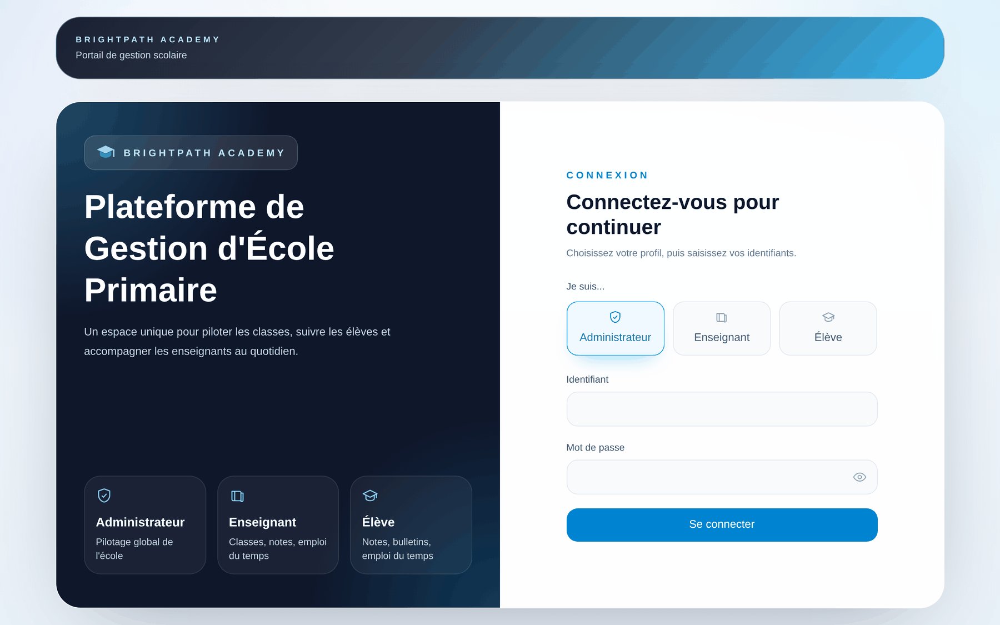

*Figure 1 — Écran de connexion : sélection du profil et saisie des identifiants.*

## 6. Présentation des espaces utilisateurs

Chaque profil dispose d'un espace organisé autour d'un menu latéral, à gauche de l'écran, qui donne accès à l'ensemble des modules disponibles pour ce profil. Le contenu de ce menu change selon que vous êtes connecté en tant qu'administrateur, enseignant ou élève.

### 6.1 Espace Administrateur

L'espace administrateur est le plus complet des trois : il donne accès à l'ensemble des modules de gestion de l'école — élèves, enseignants, classes, cours, cycles, évaluations, emplois du temps, paiements et discipline.

Le tableau de bord qui s'affiche à la connexion présente une vue d'ensemble synthétique de l'établissement : effectifs, nombre de classes, nombre d'enseignants, et raccourcis vers les actions les plus courantes.

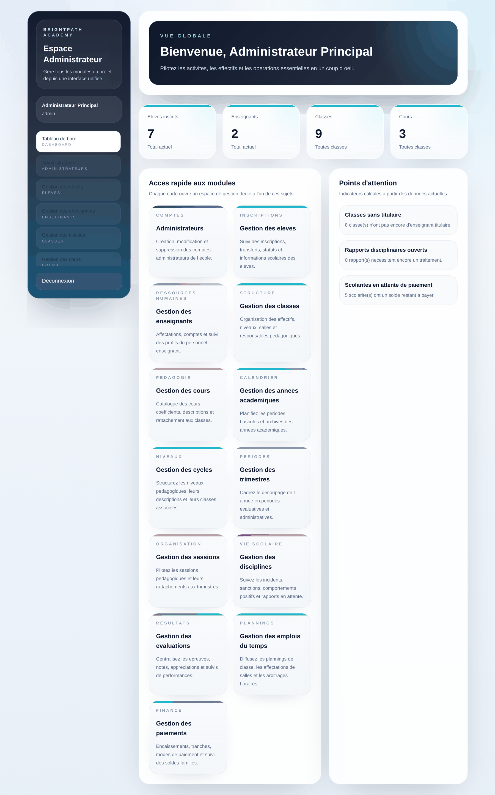

*Figure 2 — Tableau de bord de l'espace Administrateur.*

### 6.2 Espace Enseignant

L'espace enseignant se concentre sur les classes et les élèves dont l'enseignant a la charge. Il permet de consulter ses classes, la liste de ses élèves, son emploi du temps personnel, de créer des évaluations, de saisir des notes et de consulter des statistiques de performance sur ses propres cours.

Un enseignant ne voit que les données qui le concernent directement : il ne peut ni consulter les classes d'un collègue, ni modifier des informations administratives comme la création de nouvelles classes ou de nouveaux comptes.

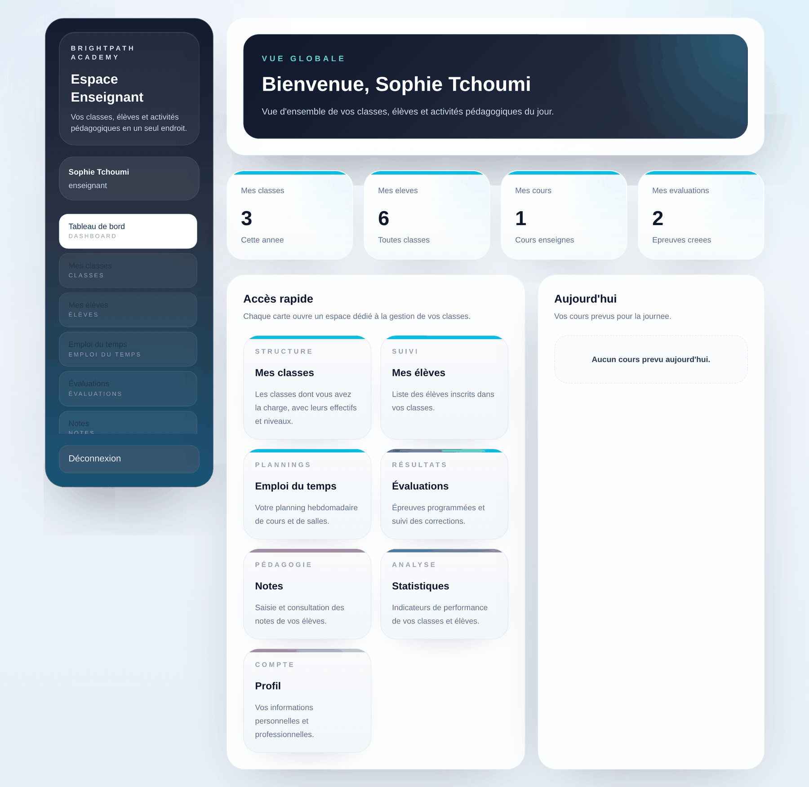

*Figure 3 — Tableau de bord de l'espace Enseignant.*

### 6.3 Espace Élève

L'espace élève est le plus simple des trois : un élève y consulte ses propres informations — ses notes, son bulletin, son emploi du temps, l'état de ses paiements de scolarité et son historique disciplinaire éventuel. Il ne dispose d'aucune fonction de modification : cet espace est entièrement dédié à la consultation.

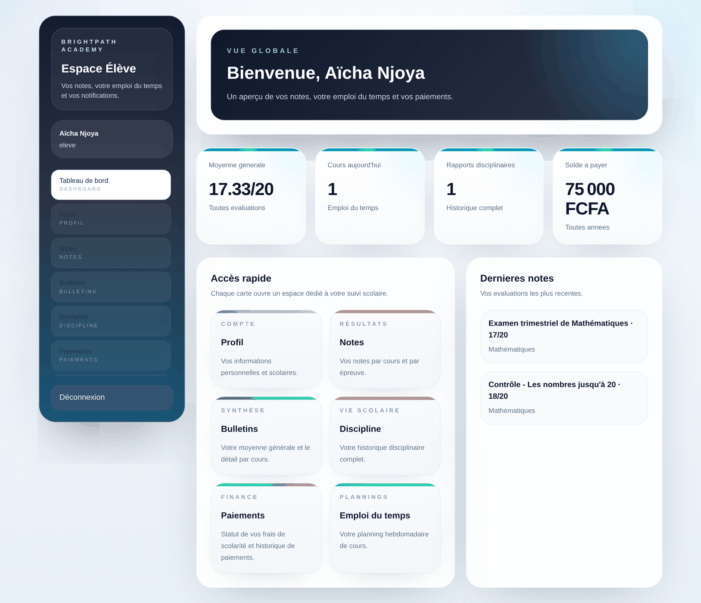

*Figure 4 — Tableau de bord de l'espace Élève.*

## 7. Description des principaux modules

Cette section détaille chacun des modules de l'application. Certains modules fonctionnent selon des principes très proches les uns des autres ; ces principes communs sont expliqués une seule fois, la première fois qu'ils apparaissent, pour éviter les répétitions inutiles.

### 7.1 Le tableau de bord

Le tableau de bord est le premier écran affiché après la connexion, pour les trois profils. Il joue le rôle d'un point de départ : il résume les informations essentielles sous forme de chiffres clés (nombre d'élèves, de classes, de notes saisies, etc.) et propose des raccourcis vers les modules les plus utilisés, sous forme de cartes cliquables.

Le contenu du tableau de bord s'adapte automatiquement au profil connecté : un administrateur y voit une vue globale de l'établissement, un enseignant une vue centrée sur ses classes, et un élève un résumé de sa situation personnelle (dernières notes, paiements, emploi du temps du jour).

### 7.2 Gestion des administrateurs

Réservée au profil administrateur, cette section permet de créer, modifier ou retirer des comptes administrateurs — les personnes habilitées à piloter l'école dans l'application. Le principe est identique à celui décrit plus loin pour la gestion des enseignants et des élèves : une liste avec recherche, un formulaire de création (nom, prénom, identifiant de connexion, mot de passe, téléphone) et une fiche de modification. Aucune capture dédiée n'est nécessaire : la logique est la même que pour les autres comptes utilisateurs, en plus simple, puisqu'un administrateur n'est rattaché à aucune classe ni à aucun cours.

### 7.3 Gestion des enseignants

Ce module permet de créer et de suivre les comptes des enseignants de l'établissement.

**Un enseignant peut enseigner plusieurs cours, dans plusieurs classes différentes.** Par exemple, un même enseignant peut assurer les Mathématiques en CP, en CE1 et en CE2. Chacune de ces combinaisons « cours + classe » est appelée une **affectation**.

À la création d'un compte enseignant, vous renseignez son identité (nom, prénom, date et lieu de naissance), ses coordonnées, son identifiant de connexion, son mot de passe, ainsi qu'une **première affectation obligatoire** : le cours qu'il enseignera, dans quelle classe.

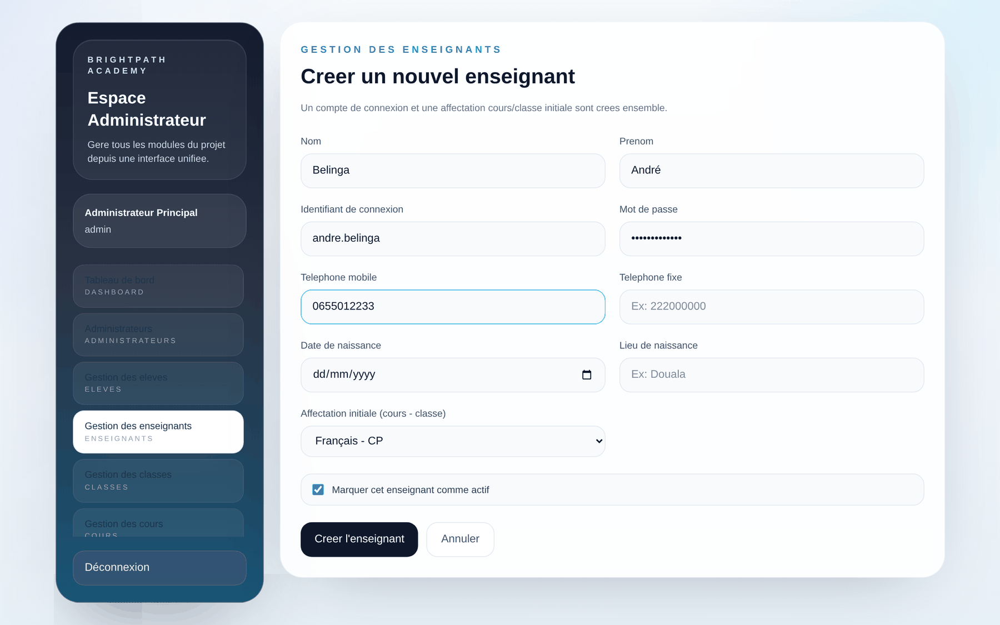

*Figure 5 — Formulaire de création d'un enseignant, avec son affectation initiale.*

Une fois le compte créé, sa fiche détaillée permet d'ajouter ou de retirer des affectations supplémentaires à tout moment, sans limite de nombre. Chaque affectation apparaît sous la forme d'une ligne « cours — classe », avec un bouton pour la retirer si l'enseignant cesse d'assurer ce cours dans cette classe.

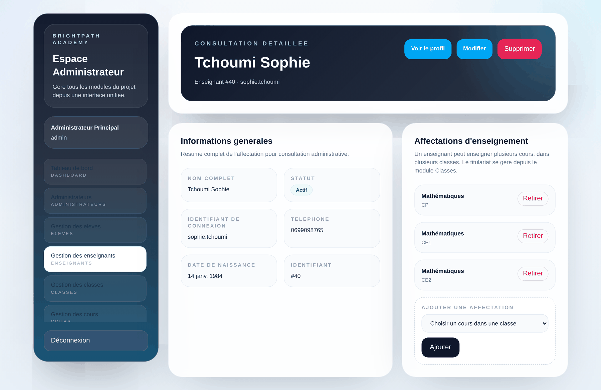

*Figure 6 — Fiche détaillée d'un enseignant : gestion de ses affectations d'enseignement.*

Cette fiche illustre bien la distinction essentielle du module : les *affectations d'enseignement* (ce que l'enseignant enseigne, et où) sont totalement indépendantes du *titulariat* d'une classe (la responsabilité pédagogique globale d'une classe), qui se gère depuis le module Classes (voir section 7.5). Un enseignant peut ainsi enseigner dans plusieurs classes tout en n'étant titulaire que d'une seule d'entre elles — ou d'aucune.

La suppression d'un enseignant retire automatiquement son compte, l'ensemble de ses affectations et, le cas échéant, son titulariat, sans laisser de trace incohérente dans l'application.

### 7.4 Gestion des élèves

Ce module regroupe l'ensemble des informations relatives aux élèves inscrits dans l'établissement : identité, classe, statut (actif ou inactif) et identifiants de connexion.

La liste des élèves peut être filtrée et recherchée par nom, ce qui facilite le repérage d'un dossier particulier dans un établissement comptant de nombreux effectifs.

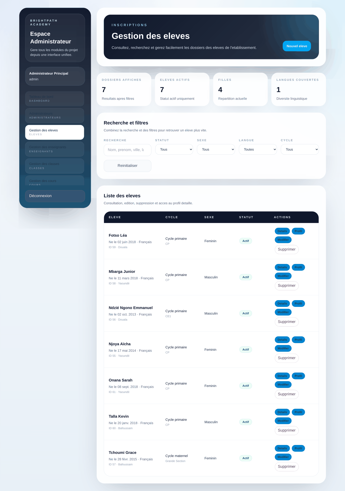

*Figure 7 — Liste des élèves, avec recherche et filtres.*

La création d'un élève reprend le principe commun à tous les formulaires de compte de l'application : identité complète (nom, prénom, date et lieu de naissance, sexe, langue), identifiant de connexion, mot de passe, puis affectation à une classe. Le cycle (maternel ou primaire) de l'élève est déterminé automatiquement en fonction de la classe choisie ; il n'a pas à être renseigné séparément.

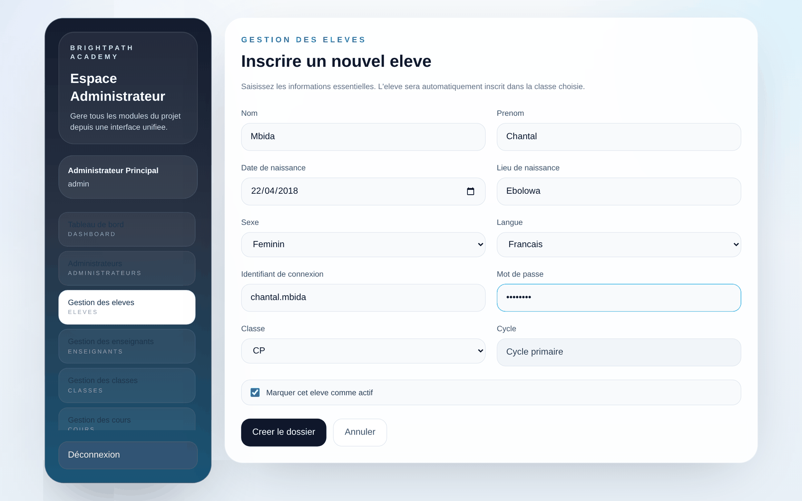

*Figure 8 — Formulaire de création d'un élève.*

L'application vérifie automatiquement la cohérence de la date de naissance saisie : une date future ou manifestement irréaliste est rejetée avec un message d'explication, ce qui évite les erreurs de saisie.

Depuis la fiche détaillée d'un élève, vous accédez également à son profil pédagogique complet — notes, bulletin, historique disciplinaire, paiements — sans avoir à naviguer entre plusieurs modules séparés.

### 7.5 Gestion des classes

Une classe regroupe un ensemble d'élèves, appartient à un cycle et dispose d'une salle. La liste des classes de l'établissement donne un aperçu rapide de chaque niveau, avec son effectif et son cycle d'appartenance.

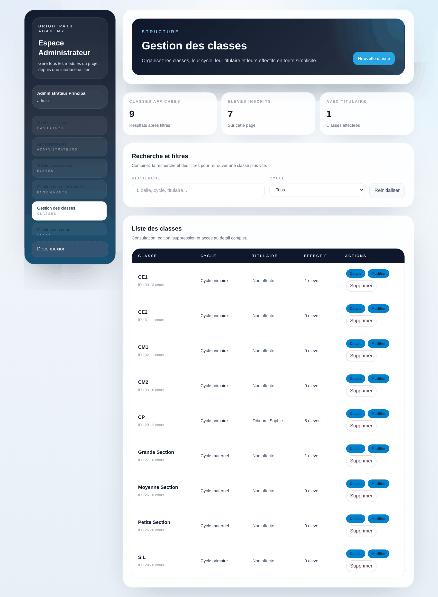

*Figure 9 — Liste des classes de l'établissement.*

La fiche détaillée d'une classe est l'écran central du module. Elle réunit :

- les informations générales de la classe (libellé, cycle, effectif, salle) ;
- la désignation du **professeur titulaire**, c'est-à-dire l'enseignant responsable de cette classe. Un menu déroulant liste les enseignants disponibles ; un seul enseignant peut être titulaire d'une classe donnée, et un même enseignant ne peut être titulaire que d'une seule classe à la fois — si vous tentez d'affecter un enseignant déjà titulaire ailleurs, l'application vous avertit et vous invite à retirer d'abord son ancien titulariat ;
- la liste des élèves inscrits, avec un formulaire permettant d'en inscrire un nouveau directement depuis cette page.

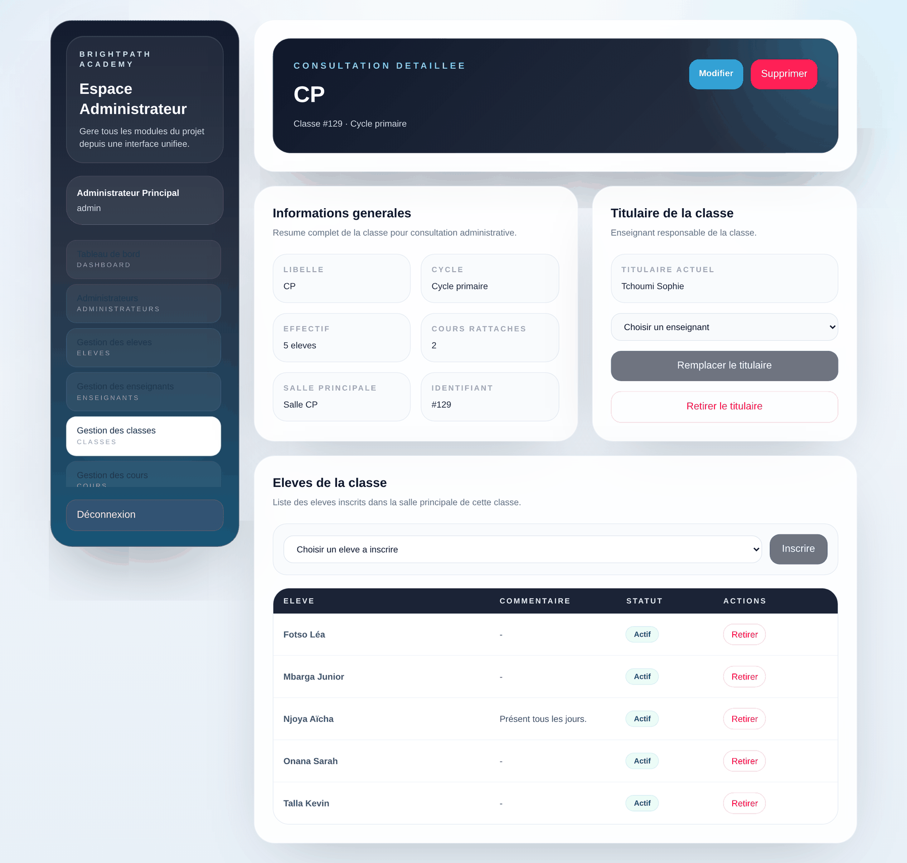

*Figure 10 — Fiche détaillée d'une classe : titulaire et élèves inscrits.*

Un élève ne peut jamais être inscrit dans deux classes en même temps : l'inscrire dans une nouvelle classe le retire automatiquement de la précédente. Ce mécanisme garantit qu'à tout moment, la situation scolaire de chaque élève reste cohérente.

La suppression d'une classe entraîne le retrait propre de toutes les données qui lui sont rattachées — élèves inscrits, titulariat, évaluations — sans laisser d'information orpheline dans l'application.

### 7.6 Gestion des cycles et du calendrier scolaire

L'établissement est structuré autour de **deux cycles fixes : le cycle maternel et le cycle primaire**. Ces deux cycles existent par défaut et ne peuvent ni être supprimés ni renommés ; seule leur description peut être ajustée depuis le module Cycles.

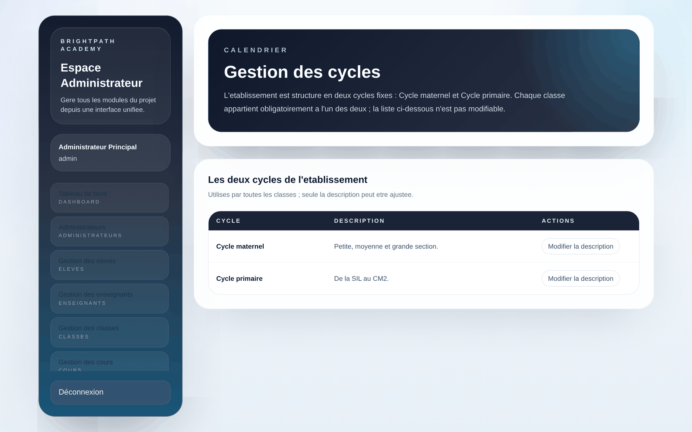

*Figure 11 — Les deux cycles fixes de l'établissement.*

Ce module de calendrier comprend également, sous des onglets voisins, la gestion des **années académiques** (par exemple « 2025-2026 »), des **trimestres** qui la composent, et des **sessions** pédagogiques rattachées à chaque trimestre. Ces trois éléments suivent le même principe simple : un libellé, une période, et pour les trimestres et les sessions, un rattachement à l'élément parent (l'année académique pour un trimestre, le trimestre pour une session). Ils permettent de structurer le calendrier scolaire de l'établissement sur toute une année.

### 7.7 Gestion des cours

Le module Cours est l'un des plus structurants de l'application. Un **cours** représente une matière — Mathématiques, Français, Sciences... — et présente une particularité importante : **un même cours peut être enseigné dans plusieurs classes à la fois.** Ainsi, les Mathématiques peuvent être enseignées en CP, en CE1 et en CE2 sous la forme d'un seul et même cours, plutôt que d'être dupliquées en trois fiches distinctes.

La fiche détaillée d'un cours illustre bien ce principe : elle affiche l'ensemble des classes dans lesquelles le cours est actuellement enseigné, et pour chacune, les enseignants qui en ont la charge.

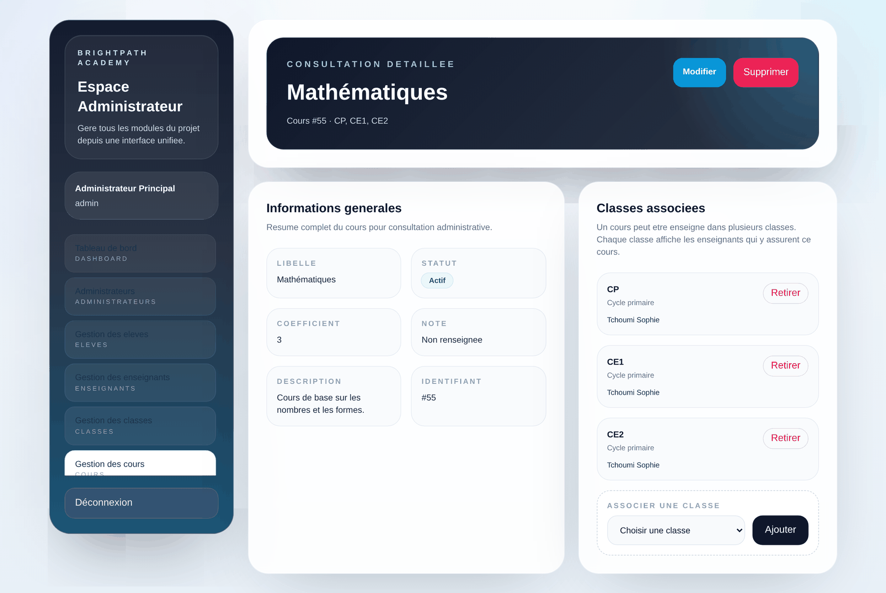

*Figure 12 — Fiche détaillée d'un cours : classes associées et enseignants.*

Vous pouvez, à tout moment, associer le cours à une classe supplémentaire ou l'en retirer, directement depuis cette fiche, sans avoir à passer par le module Enseignants.

À la création d'un nouveau cours, un ensemble de cases à cocher vous permet de sélectionner directement toutes les classes concernées :

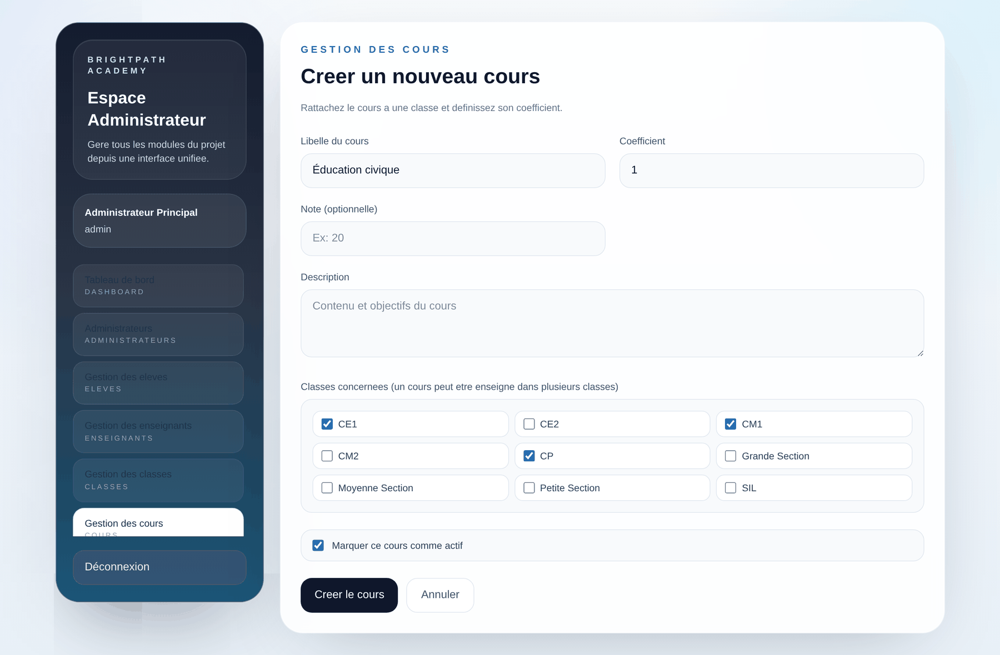

*Figure 13 — Formulaire de création d'un cours : sélection de plusieurs classes.*

Retirer un cours d'une classe supprime automatiquement les affectations d'enseignants qui y étaient liées pour cette classe précise ; les affectations de ce même cours dans les autres classes restent, elles, inchangées.

### 7.8 Gestion des évaluations

Une **évaluation** — appelée *épreuve* dans l'application — représente un contrôle ou un examen organisé pour une classe. Deux types d'épreuves sont proposés : **Contrôle** et **Examen**.

La création d'une épreuve se fait en deux temps : vous choisissez d'abord la **classe** concernée, puis, si vous le souhaitez, le **cours** précis auquel l'épreuve se rattache parmi ceux enseignés dans cette classe. Ce second choix affine simplement le rattachement de l'épreuve ; il reste facultatif.

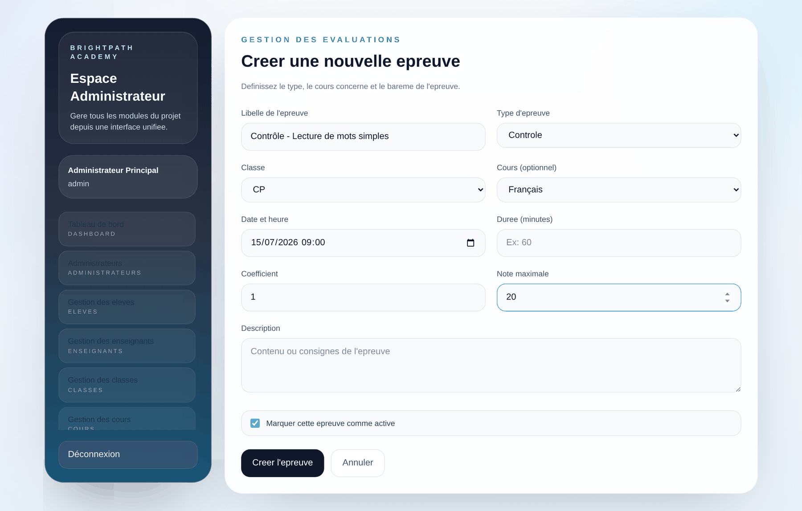

*Figure 14 — Formulaire de création d'une évaluation.*

Vous renseignez également le libellé de l'épreuve, sa date, sa durée, son coefficient et sa **note maximale** (le barème sur lequel elle est notée, généralement 20). Cette note maximale est ensuite utilisée automatiquement par l'application pour empêcher la saisie d'une note supérieure au barème.

Une fois l'épreuve créée, sa fiche détaillée affiche en temps réel les statistiques calculées à partir des notes saisies — moyenne de classe, meilleure note, note la plus faible — ainsi qu'un classement complet des élèves évalués, du premier au dernier.

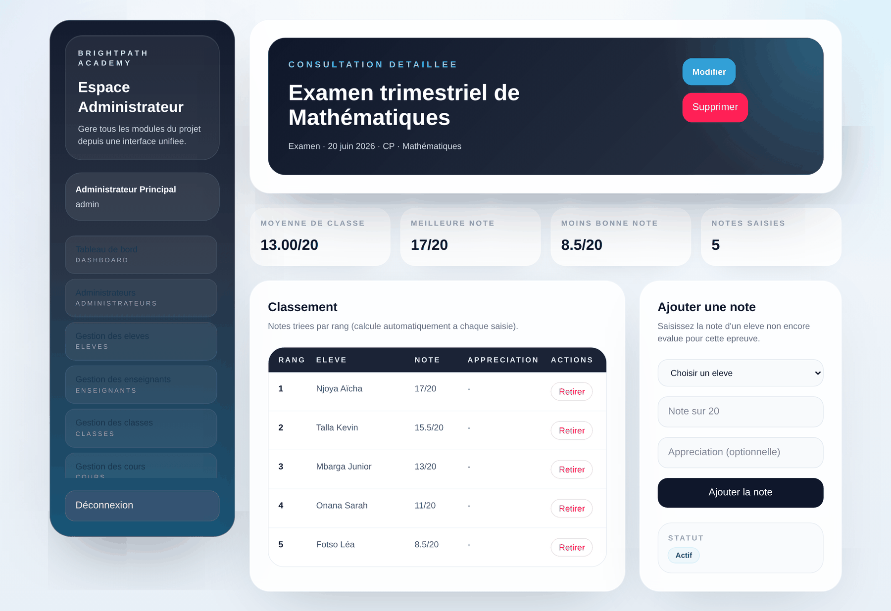

*Figure 15 — Fiche détaillée d'une évaluation : statistiques et classement des élèves.*

### 7.9 Gestion des notes

La saisie des notes s'effectue soit depuis la fiche d'une épreuve (module Évaluations, décrit ci-dessus), soit depuis l'espace enseignant, où chaque enseignant retrouve la liste de ses propres épreuves et peut y saisir directement les notes de ses élèves, épreuve par épreuve.

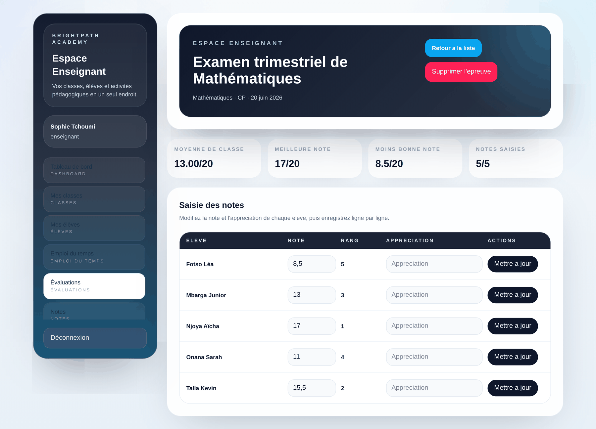

*Figure 16 — Saisie des notes depuis l'espace enseignant.*

Pour chaque élève de la classe concernée, vous renseignez la note obtenue et, si vous le souhaitez, une appréciation libre. Le rang de l'élève au sein de la classe se recalcule automatiquement à chaque nouvelle saisie, sans action supplémentaire de votre part.

L'application refuse toute note supérieure à la note maximale définie pour l'épreuve, avec un message d'erreur explicite, ce qui élimine les erreurs de saisie fréquentes lors de la correction de nombreuses copies.

### 7.10 Gestion des bulletins

Le bulletin d'un élève rassemble, sur un seul écran, sa **moyenne générale** ainsi que le détail de sa moyenne pour chacun des cours qu'il suit, avec le coefficient et le nombre d'évaluations pris en compte pour chacun.

Ces moyennes sont calculées automatiquement par l'application à partir de l'ensemble des notes déjà saisies, pondérées par le coefficient de chaque épreuve puis par celui de chaque cours. Aucun calcul manuel n'est nécessaire.

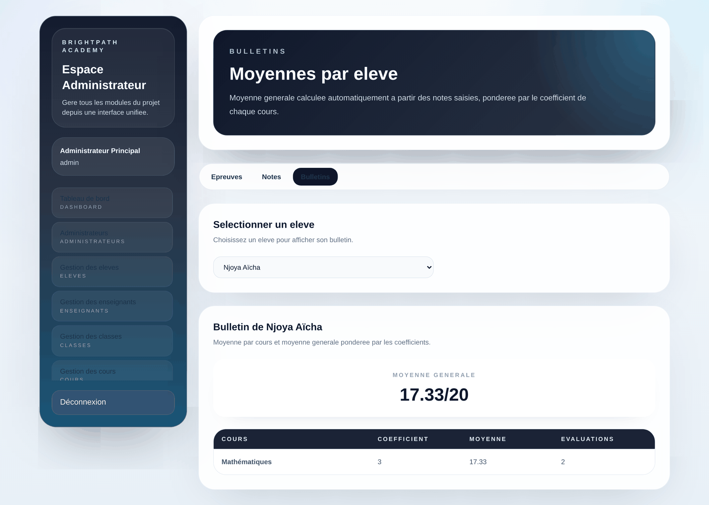

*Figure 17 — Bulletin d'un élève : moyenne générale et détail par cours.*

Côté administrateur, ce bulletin est consultable pour n'importe quel élève de l'établissement, en le sélectionnant dans une liste déroulante. Côté élève, chacun retrouve directement son propre bulletin, sans étape de sélection, dans son espace personnel.

### 7.11 Gestion des emplois du temps

Ce module permet de définir, classe par classe, les créneaux horaires hebdomadaires : jour, heure de début, heure de fin, cours dispensé et, si besoin, salle occupée. Chaque créneau est associé à une classe et à un cours ; l'application vérifie automatiquement l'absence de chevauchement horaire pour une même classe ou une même salle, afin d'éviter les conflits de planning.

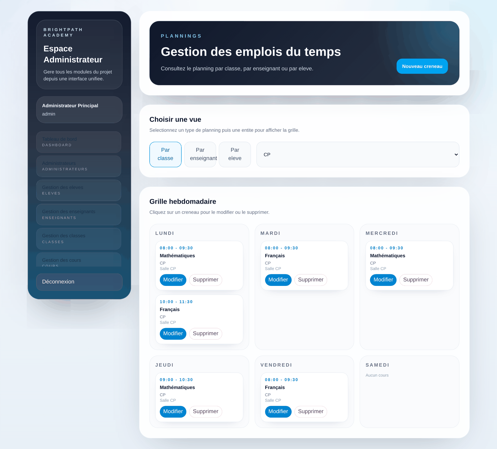

*Figure 18 — Grille hebdomadaire d'emploi du temps.*

Chaque enseignant retrouve, dans son propre espace, uniquement les créneaux correspondant aux cours qu'il assure dans les classes où il est affecté — sa grille personnelle se construit donc automatiquement à partir de ses affectations, sans configuration supplémentaire. Les élèves disposent du même principe : ils consultent la grille de leur classe depuis leur espace personnel.

### 7.12 Gestion des paiements

Ce module suit le règlement des frais de scolarité. Il repose sur quatre éléments complémentaires, accessibles par onglets :

- **Scolarités** : l'inscription financière d'un élève pour une année académique donnée, dans une classe précise, avec les frais attendus (inscription et scolarité) et une éventuelle réduction.
- **Tranches** : les échéances de paiement définies par l'établissement (par exemple Tranche 1, Tranche 2, Tranche 3), chacune avec son montant et sa date d'échéance.
- **Modes de paiement** : le mode utilisé pour un règlement (espèces, virement bancaire, mobile money...).
- **Paiements** : chaque versement effectivement enregistré, rattaché à une scolarité, une tranche et un mode de paiement.

La liste des paiements permet de rechercher, filtrer par classe, mode ou statut, et de consulter en un coup d'œil le total encaissé.

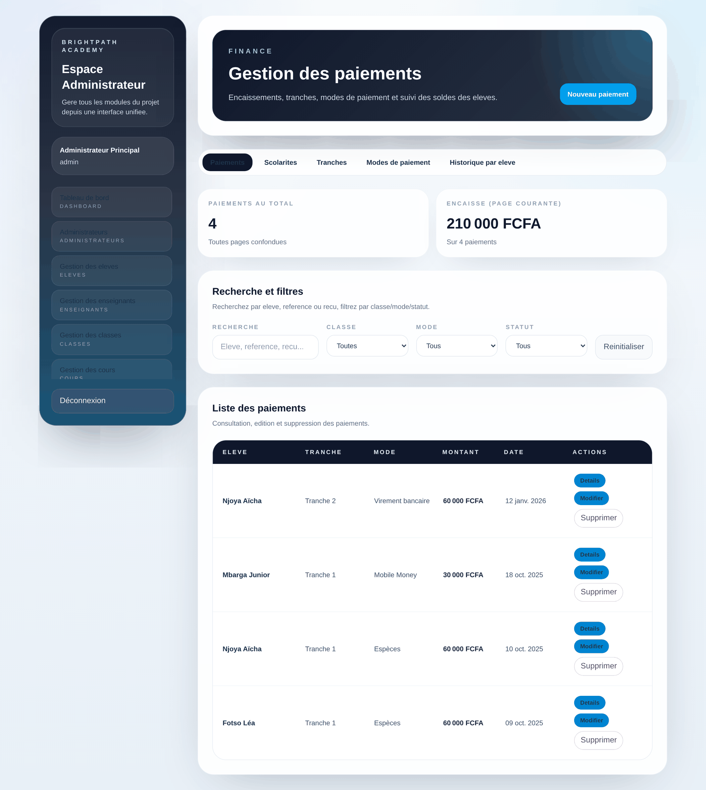

*Figure 19 — Liste des paiements, avec recherche et filtres.*

Pour enregistrer un nouveau paiement, vous sélectionnez la scolarité de l'élève concerné, la tranche réglée, le mode de paiement utilisé, le montant versé, ainsi que, si vous le souhaitez, une référence et un numéro de reçu.

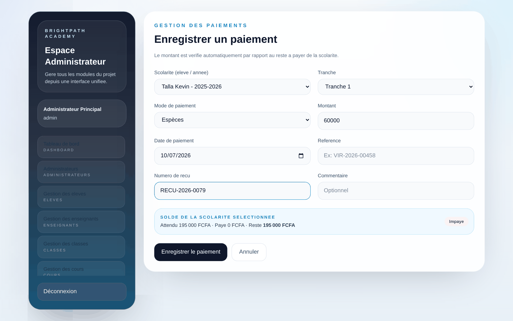

*Figure 20 — Formulaire d'enregistrement d'un paiement.*

Le statut de chaque scolarité — **Impayé**, **Partiellement payé** ou **Payé** — se met à jour automatiquement en fonction des versements enregistrés, sans calcul manuel. Un onglet Historique permet de consulter, pour un élève donné, l'ensemble de ses versements sur toute l'année.

### 7.13 Gestion de la discipline

Ce module permet de suivre le comportement des élèves, qu'il s'agisse de fautes ou de comportements positifs à valoriser.

Il repose sur deux niveaux : un **catalogue de types de discipline** (par exemple « Retard répété », « Bagarre » ou « Participation exemplaire »), chacun défini par sa nature (faute ou comportement positif), son degré de gravité et le type de sanction habituellement associé ; et des **rapports individuels**, qui consignent un incident précis pour un élève donné.

La liste des rapports donne une vue d'ensemble des incidents enregistrés, avec leur statut de traitement.

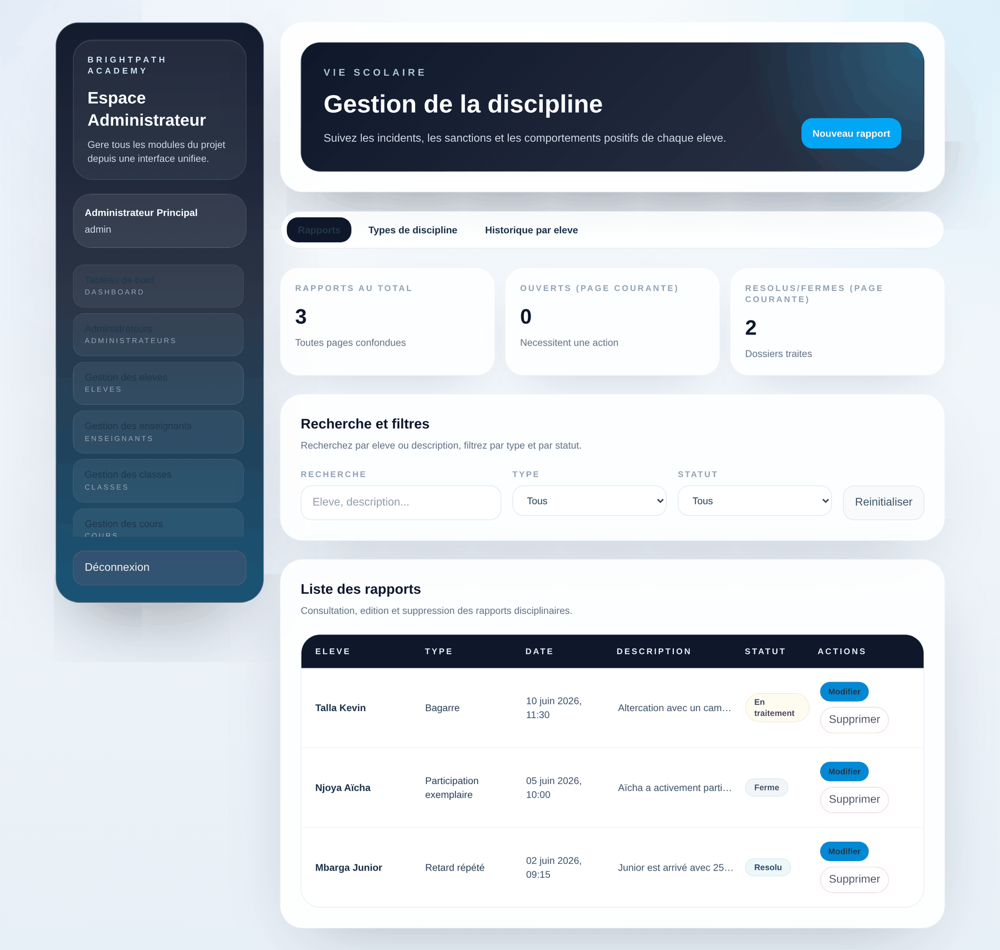

*Figure 21 — Liste des rapports de discipline.*

La création d'un rapport se fait en renseignant l'élève concerné, le type de discipline dans le catalogue, l'auteur du rapport, une description détaillée des faits, d'éventuels témoins et la sanction appliquée.

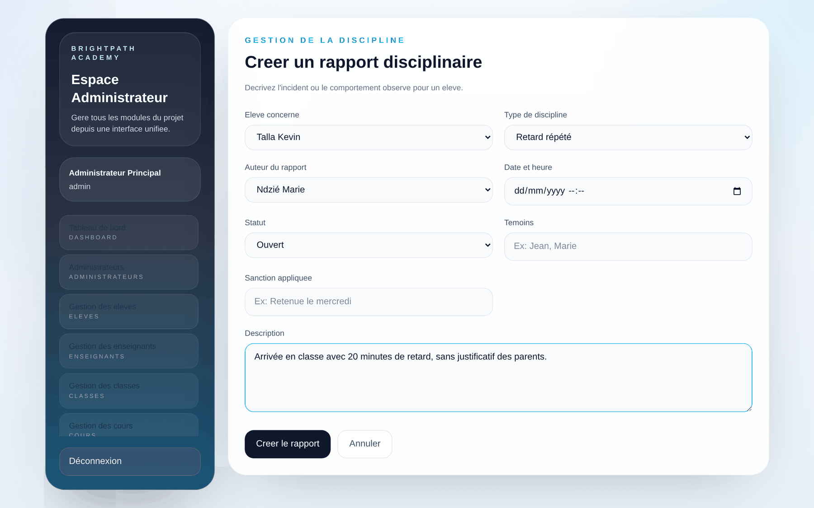

*Figure 22 — Formulaire de création d'un rapport de discipline.*

Chaque rapport suit un statut de traitement — **Ouvert**, **En traitement**, **Résolu** ou **Fermé** — que vous pouvez faire évoluer au fil du suivi du dossier. Un module Historique permet de consulter, pour un élève donné, l'ensemble de son parcours disciplinaire.

## 8. Scénarios d'utilisation

Cette section propose des parcours pas à pas pour les opérations les plus courantes. Elle s'appuie sur les modules déjà présentés en détail dans la section précédente ; reportez-vous aux figures correspondantes en cas de besoin.

### 8.1 Créer un élève

1. Depuis le menu latéral, ouvrez **Gestion des élèves**.
2. Cliquez sur **Nouvel élève**.
3. Renseignez l'identité de l'élève (nom, prénom, date et lieu de naissance, sexe, langue).
4. Renseignez un identifiant de connexion et un mot de passe : ce sont les identifiants que l'élève utilisera pour se connecter à son propre espace.
5. Choisissez sa classe : le cycle est déterminé automatiquement.
6. Cliquez sur **Créer l'élève**.

L'élève apparaît immédiatement dans la liste et dans les effectifs de sa classe.

### 8.2 Créer une classe

1. Depuis le menu latéral, ouvrez **Gestion des classes**.
2. Cliquez sur **Nouvelle classe**.
3. Renseignez le libellé de la classe (par exemple « CE2 ») et choisissez son cycle.
4. Validez la création.

Une salle principale est automatiquement créée pour la nouvelle classe. Vous pouvez ensuite y inscrire des élèves et lui affecter un titulaire depuis sa fiche détaillée.

### 8.3 Désigner un professeur titulaire

1. Ouvrez la fiche détaillée de la classe concernée depuis **Gestion des classes**.
2. Dans la section **Titulaire de la classe**, sélectionnez l'enseignant souhaité dans le menu déroulant.
3. Cliquez sur **Affecter comme titulaire**.

Deux cas particuliers peuvent se présenter :

- **La classe a déjà un titulaire** (que vous souhaitez remplacer par un autre enseignant) : l'application vous demande simplement de confirmer le remplacement avant de l'appliquer.
- **L'enseignant choisi est déjà titulaire d'une autre classe** : un même enseignant ne pouvant être titulaire que d'une seule classe à la fois, l'application refuse l'opération et vous invite à retirer d'abord son titulariat sur cette autre classe avant de recommencer.

### 8.4 Créer une évaluation

1. Depuis le menu latéral (espace administrateur) ou depuis **Évaluations** (espace enseignant), cliquez sur **Nouvelle épreuve**.
2. Renseignez le libellé de l'épreuve et choisissez son type : **Contrôle** ou **Examen**.
3. Sélectionnez la classe concernée, puis, si nécessaire, le cours précis parmi ceux enseignés dans cette classe.
4. Renseignez la date, le coefficient et la note maximale.
5. Validez la création.

L'épreuve est immédiatement disponible pour la saisie des notes.

### 8.5 Saisir les notes

1. Ouvrez la fiche de l'épreuve concernée.
2. Pour chaque élève de la classe, saisissez sa note et, si vous le souhaitez, une appréciation.
3. Cliquez sur **Enregistrer** (ou **Mettre à jour** si une note existait déjà) pour chaque élève.

Le classement et les statistiques de l'épreuve (moyenne, meilleure note, note la plus faible) se mettent à jour automatiquement à chaque saisie.

### 8.6 Enregistrer un paiement

1. Depuis le menu latéral, ouvrez **Gestion des paiements**.
2. Cliquez sur **Nouveau paiement**.
3. Sélectionnez la scolarité de l'élève concerné, la tranche réglée et le mode de paiement utilisé.
4. Renseignez le montant versé et, si vous le souhaitez, une référence et un numéro de reçu.
5. Validez l'enregistrement.

Le statut de la scolarité (Impayé, Partiellement payé, Payé) se met à jour automatiquement.

### 8.7 Consulter un bulletin

**Depuis l'espace administrateur :**

1. Ouvrez **Gestion des évaluations**, puis l'onglet **Bulletins**.
2. Sélectionnez l'élève souhaité dans la liste déroulante.

**Depuis l'espace élève :**

1. Ouvrez directement le module **Bulletins** dans le menu latéral : votre propre bulletin s'affiche sans étape supplémentaire.

Dans les deux cas, la moyenne générale et le détail par cours s'affichent instantanément, calculés à partir des notes déjà saisies.

## 9. Questions fréquentes (FAQ)

**Un enseignant ou un élève a oublié son mot de passe : que faire ?**
L'application ne dispose pas d'un système de réinitialisation automatique par e-mail. Un administrateur doit ouvrir la fiche de modification de la personne concernée et lui définir un nouveau mot de passe. Le champ mot de passe peut être laissé vide lors d'une modification si vous ne souhaitez pas le changer.

**Peut-on inscrire un élève dans deux classes en même temps ?**
Non. Inscrire un élève dans une nouvelle classe l'en retire automatiquement de son ancienne classe. Ce comportement est volontaire : il garantit qu'un élève n'appartient jamais qu'à une seule classe à la fois.

**Un même enseignant peut-il être titulaire de deux classes ?**
Non. Un enseignant peut enseigner dans plusieurs classes, mais n'être titulaire que d'une seule à la fois. Pour changer de titulaire, retirez d'abord l'ancien titulariat avant d'en affecter un nouveau.

**Que se passe-t-il si je supprime une classe qui contient des élèves ?**
La suppression d'une classe retire proprement toutes les données qui lui sont rattachées : élèves inscrits, titulariat, évaluations. Cette action est irréversible ; l'application vous demande toujours une confirmation avant de l'exécuter.

**Un cours peut-il être enseigné par plusieurs enseignants différents ?**
Oui, à condition que ce soit dans des classes différentes. Un même cours peut être assuré par un enseignant en CP et par un autre en CE1, par exemple.

**Comment savoir si un paiement est complet ?**
Le statut de la scolarité de l'élève (Impayé, Partiellement payé, Payé) est calculé et affiché automatiquement, sans qu'il soit nécessaire de faire le total manuellement.

**Une note peut-elle dépasser le barème de l'épreuve ?**
Non. L'application refuse systématiquement toute note supérieure à la note maximale définie pour l'épreuve, afin d'éviter les erreurs de saisie.

**Un élève voit-il les notes ou les dossiers disciplinaires des autres élèves ?**
Non. Chaque élève ne consulte que ses propres informations. De même, un enseignant ne voit que les classes dans lesquelles il est affecté.

## 10. Bonnes pratiques

- **Vérifiez l'orthographe des noms** à la création d'un élève ou d'un enseignant : ces informations apparaissent ensuite sur les bulletins et les documents officiels.
- **Créez d'abord les cycles et les classes**, avant de créer les cours et les enseignants, afin de pouvoir les rattacher directement lors de leur création.
- **Associez un cours à toutes ses classes dès sa création** lorsque cela est possible : cela évite d'avoir à revenir modifier chaque cours individuellement par la suite.
- **Gardez une trace des identifiants distribués** aux enseignants et aux élèves, en particulier lors de la mise en place initiale de l'application.
- **Traitez les rapports de discipline au fil de l'eau** : un dossier laissé au statut « Ouvert » trop longtemps perd en pertinence pour le suivi de l'élève.
- **Vérifiez les notes saisies** avant de les considérer comme définitives : bien que l'application empêche les erreurs de dépassement de barème, une erreur de frappe sur une note plausible (par exemple 12 au lieu de 21) reste possible et doit être relue.
- **Ne partagez jamais votre mot de passe**, y compris entre collègues : chaque compte est personnel et permet de tracer les actions effectuées dans l'application.

## 11. Conclusion

BrightPath Academy centralise, dans un espace unique, l'ensemble des tâches administratives et pédagogiques d'une école primaire : inscriptions, classes, cours, enseignants, évaluations, bulletins, emplois du temps, paiements et discipline. Les principes qui structurent l'application — un cours pouvant être enseigné dans plusieurs classes, un enseignant pouvant cumuler plusieurs affectations tout en n'étant titulaire que d'une seule classe, des calculs automatiques de moyennes et de statuts — visent à limiter les tâches répétitives et les erreurs de saisie, tout en gardant une utilisation simple au quotidien.

Ce manuel couvre l'ensemble des fonctionnalités disponibles à ce jour. Pour toute question non traitée dans ce document, rapprochez-vous de l'administration de votre établissement.

---

*Fin du manuel utilisateur.*
